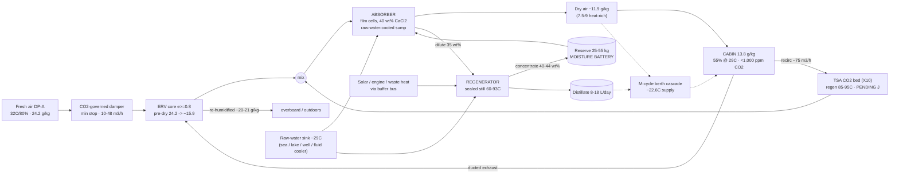

# 10 — Liquid Track: Concept and Physics

### v1.0 — CaCl₂ brine dehumidification with mixed-mode ventilation

**Function:** The low-energy, solar-grade comfort layer: hold a ~100 m³ occupied
space at ~55% RH for four adults at DP-A on 25–80 W of electricity and ~9–11 kWh/day
of 60–93 °C heat, with berth-scale evaporative spot cooling and a moisture battery.
Shared basis, design point, and doctrines → doc 00.

---

## 1. The problem at the design point

DP-A (32 °C / 80%, ω 24.2 g/kg, dew point 28.1 °C, raw-water sink ~29 °C). Comfort
target **29 °C / 55% RH → ω = 13.8 g/kg**. Occupant latent load ≈ 70 g/h·person
average (50 sleeping, 90 active). Conventional answers fail the constraints:

- **Vapor-compression A/C**: 1–3 kW electrical → generator/grid dependence, a
  refrigerant circuit, and (marine) a salt-air-hostile machine.
- **Sub-dew-point condensation** is handicapped: the raw-water sink is *warmer
  than the dew point*, so nothing passively cold exists to condense on (doc 00 §3).
- **Solid desiccant wheels** regenerate with 300–600 W electric heaters.
- **Small heat-driven chillers** are commercially extinct below ~11 kW.

## 2. Operating principle

**Vapor-pressure depression does the drying — no cold surface required.**

1. Concentrated CaCl₂ brine at **40 wt%** has water activity **aw ≈ 0.45**: air in
   contact equilibrates near 45% RH *at the brine's temperature*. With the sink at
   29 °C the brine runs 29–30 °C → **outlet floor ~11.9 g/kg** (design basis); the
   outlet is a **temperature-dependent band, not a point** (floor matrix, doc 12).
2. **Mixed-mode air path (occupied baseline, X6):** fresh air at the CO₂-governed
   minimum (48 m³/h for 4, through the ε ≥0.8 ERV) plus **recirculated cabin air
   (~75 m³/h)** together pass through the brine contactor — ~123 m³/h total. The
   recirculation decouples removal capacity from the ventilation ration; the fresh
   minimum and interlock are fixed by doc 00 §5. Positive pressure is held;
   recirc-only operation is prohibited while occupied. Once-through operation is
   retained for unattended/mothball and low-occupancy modes (2 adults with cooled
   brine: ~54–58% RH — stands on the base system).
3. Absorbed water dilutes the brine toward **35 wt%**; each kg of 40 wt%
   concentrate absorbs **0.143 kg water** (0.40/0.35 − 1).
4. A peristaltic pump trades dilute brine (0.04–0.2 L/min) to the **regenerator**:
   heat at 60–93 °C raises the brine's vapor pressure far above the sink-cooled
   condenser's (aw 0.55 at 65 °C → Pv ≈ 13.8 kPa vs ~4–5 kPa) and the water leaves
   — into a **sealed still** as distillate (primary), or a swept airstream
   (degraded mode, now condensed per X8 rule 3).
5. Regenerated concentrate returns to reserve. **Concentration is storage.**

### The moisture battery

At DP-A occupied duty (0.88 kg/h peak, doc 12 §1) a full night of 4-adult
operation with zero heat input costs **~35–40 kg of 40 wt% concentrate**
(12 h ÷ 0.143, duty-averaged) — inside the 25–55 kg reserve spec, noted for tank
sizing. Regenerate by day (solar) or from engine/waste heat; absorb any time. A
storm that defeats the absorber is an hours-to-a-day event — shorter than the
reserve. The CO₂ battery (doc 00 §5) mirrors this pattern on the air-quality side.

### The closed water loop (Phase 2)

The still's distillate feeds a **Maisotsenko-cycle (M-cycle) dew-point indirect
evaporative cooler**. M-cycle cooling is useless on raw DP-A air (dew point
28.1 °C is its floor) but potent on dried air:

| Feed air | Dew point | Supply (ε_dp 0.65–0.80) |
|---|---|---|
| 11.9 g/kg (base CaCl₂, cooled brine) | 16.7 °C | ~21–23 °C |
| 9.0 g/kg (hot regen) / 7.5–8 (LiCl blend) | 12.5 / ~10 °C | ~18–21 / ~15–18 °C |

Full chain: **sun → hot brine → dry air + distilled water → cool dry air.**

**Berth-scale cascade (the adopted Phase-2 topology, X5):** the M-cycle rides the
ventilation stream — all 48 m³/h delivered to the cabin as product; the working
air (⅓) is drawn *from the cabin* and exhausted saturated. At DP-A: supply
~22.6 °C, ~102 W sensible at the outlet, full ventilation preserved, water draw
~4.1 L/day (≤ distillate). The classic dry-channel bleed is rejected: it silently
exhausts a third of the ventilation (CO₂ → ~2,700 ppm) for less delivered cooling
(~86 W). **Whole-cabin M-cycle AC is deferred** — X1: it never composes with
once-through (5.5–11 kg/h absorber duty), and in recirculation topology it
converges to solid-track-class duty (~10.6 kg/h, ~11 kW heat; doc 00 §6).

## 3. Governing quantities (the model in nine lines, DP-A)

| Quantity | Relation | Design value |
|---|---|---|
| Removal rate, mixed-mode 4 adults | Σ flow × (ω_in − ω_floor) | **0.88 kg/h peak** (fresh 58 kg/h from 24.2 pre-dried 17.4 by ERV, + recirc from 13.8, to floor 11.9) |
| Water per kg concentrate | c_hi/c_lo − 1 | 0.143 kg (40→35 wt%) |
| Transfer brine flow | removal ÷ 0.143 ÷ ρ | 0.07 avg / 0.35 peak L/min |
| Regen latent duty | removal × 2.44 MJ/kg | 0.60 kW at 0.88 kg/h |
| Regen heat at COP 0.55–0.75 | latent ÷ COP | **~0.92 kW peak; 17–20 kWh/day bare, ~9–11 with ERV + DCV** |
| Absorption heat into brine | removal × ~2.7 MJ/kg | **0.66 kW** — must be rejected (raw-water coil) |
| Cooling leverage | ∂w_eq/∂T at aw 0.45 | **0.5–0.7 g/kg per °C of brine cooling** (land sinks: free depth) |
| CO₂ battery heat (doc 00 §5) | 1.6 kg/day × 1.0–1.3 kWh/kg | ~1.6–2.5 kWh/day |
| Crystallization liquidus | CaCl₂ solubility curve | 40 wt% ≈ **12–13 °C**; 44 wt% ≈ 22 °C |

Two facts dominate system character:

- **Absorber cooling is required, not optional.** 0.66 kW enters the sump; the air
  stream removes only ~35 W/K, so an uncooled contactor self-limits by warming
  +5–8 K and doing less work (floor 12–14+ g/kg). ~300 L/h of raw water through a
  titanium coil (5–15 W pump) holds the design floor.
- **COP stops mattering when heat is generous.** With engine-jacket, waste, or
  oversized solar heat, the binding constraints become materials temperature
  ceilings, contactor area, and heat rejection — not energy. At 85–93 °C
  regeneration (within CPVC's rating) plain CaCl₂ reaches 43–44 wt% (aw
  0.33–0.35) → floor **7.5–9 g/kg** without LiCl.

## 4. Why these choices (decision record)

| Decision | Over | Because |
|---|---|---|
| Liquid desiccant | vapor-compression | No compressor; chloride-immune by construction; heat-driven (solar/diesel/engine/waste all serve); storage free as concentration. The wins are resilience and heat flexibility, **not watts** |
| Liquid | solid beds | Pumpable, continuous, motion-tolerant; deliquescence becomes the operating principle instead of the failure mode |
| Film (trickle) media primary | bubble columns | ~90% electrical cut (5–100 Pa vs 1.4–2.8 kPa air-side); columns retained as annex for sustained heel; storm fallback is **flooded-media mode**, not gimbals |
| CaCl₂ | LiCl / LiBr / MgCl₂ / glycols | Adequate depth at 1/20–1/50 LiCl's cost → cheap oversized storage. LiCl remains a comfort-spike upgrade; glycols excluded (vapor carryover into breathed air) |
| **Mixed-mode (fresh minimum + recirc)** | once-through-only | Once-through fails 4-adult comfort at DP-A (59–66% RH) and couples removal to the ventilation ration; mixed-mode restores 55% RH on base brine at 0.88 kg/h with CO₂ unchanged at the interlocked floor. Once-through retained for unattended and low-occupancy duty, where per-pass depth on the wettest air still wins |
| **ERV latent recovery on the fresh stream (X7)** | bare fresh intake | (1−ε)×10.4 g/kg per kg of fresh air; at ε 0.8 the DP-A fresh-air penalty drops ~9–10 kWh/day and generous ventilation becomes cheap. Requires one ducted exhaust path (semi-balanced flow) |
| Buffer-tank thermal bus | direct coupling | Merges solar + hydronic + engine/waste heat into one 65–90 °C supply; kills short-cycling; provides DHW |
| Sealed-still regeneration | air-swept | Deletes regen blower, demister, salty-exhaust routing; captures distillate; most motion-tolerant regenerator possible. Air-swept retained as degraded mode, now condensed (X8) |

## 5. Performance envelope (DP-A)

| Scenario | Outcome |
|---|---|
| 4 adults, once-through, base brine | 59–66% RH — **fails**; mode retired for full occupancy |
| **4 adults, mixed-mode, cooled base brine (baseline)** | **~55% RH at 29 °C** · 0.88 kg/h · 9–11 kWh/day with ERV |
| 2 adults, once-through, cooled brine | ~54–58% RH — stands |
| Unattended, 0.1 ACH, 1 contactor | mold-safe to **~160–215 m³** (60–65% RH basis) / ~90 m³ holding 13 g/kg, on ~30–50 W + trickle of heat |
| Berth cascade M-cycle | ~22.6 °C supply, ~102 W/outlet, full ventilation, ~4 L/day water |
| Heat-rich (85–93 °C regen) | floor 7.5–9 g/kg; whole-cabin AC deferred (converges to solid-track duty) |
| CO₂, all occupied modes | <1,000 ppm via the doc 00 §5 stack (ventilation floor alone reads 1,920) |

## 6. System flow (concept level)

Detailed air-path diagram: `diagrams/dpa-mixed-mode-airpath.svg`.

---
*Part of an open defensive-publication release: hardware CERN-OHL-P v2, text
CC-BY-4.0. No patents sought or held. Unbuilt paper design — see LICENSE.*

*Version history*
- **v1.0** — New lineage from archived core-01: restated at DP-A (sole point);
  mixed-mode baseline (X6) and ERV (X7) integrated; berth cascade adopted and
  whole-cabin AC deferred (X1/X5); moisture battery resized; land/marine sink
  generalization per doc 00.
