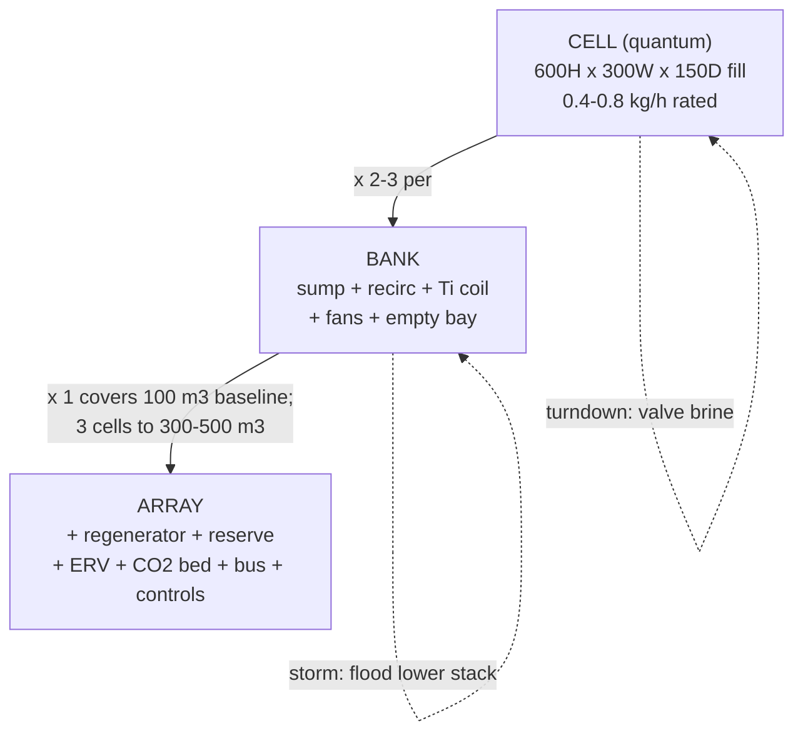
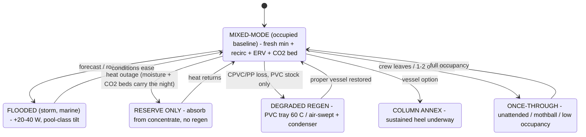

# 11 — Liquid Track: Architecture and Materials

### v1.2 — hardware, materials law, and operating modes

**Function:** Buildable architecture for doc 10: the film-cell bank, aerosol
control, sealed still, ERV and CO₂-battery placements, brine circulation, thermal
bus, raw-water circuit, and the bubble-column annex. Shared doctrines and the
safety register → doc 00.

---

## 1. The two-worlds rule (load-bearing)

Everything on the brine/raw-water side is **metal-free**: plastics, elastomers,
titanium. Everything on the hot-water/glycol side is ordinary hydronics (copper,
brass, steel welcome). **Titanium heat exchangers are the only membrane between
the worlds** — never let the fluids mix. These rules are **never relaxed for land
installs** — the desiccant itself is the chloride source (doc 00 §1).

### Master materials table (every brine- or raw-water-wetted component)

| Status | Materials |
|---|---|
| **Use freely** | PVC (≤60 °C), CPVC (≤93 °C), PP, HDPE/PE/PE-RT, PEX, PVDF, titanium, EPDM, FKM, silicone, ceramic/alumina, glass, acetal (POM) |
| **Never** | Copper, brass, bronze; aluminum (incl. anodized); zinc/galvanized; mild steel; 304 SS; **nylon/polyamide** (CaCl₂ is a documented stress-cracking agent for loaded PA parts — the automotive road-salt failure mode) |
| **Marginal — don't design in** | 316/316L: brief splash only; never warm immersion or crevice geometry (threads, brazed channels, gasket lands) |

Wetted fasteners: **PP / PVC / PVDF only**. Rule of thumb: parts sold for pools,
aquaculture, or chemical dosing are probably right; parts sold for plumbing hide
brass. **Any brazed-plate exchanger (304 + copper braze) is forbidden on brine or
raw water** — glycol↔buffer isolation duty only.

Salt: plain 94–97% CaCl₂ pellet or 83–87% flake — SDS-check for no additives (no
ferrocyanide, dye, or MgCl₂ blend). Add salt to water slowly (strongly
exothermic). Tap water is fine.

## 2. Primary absorber — modular film-cell bank

Built entirely from cooling-tower commodity parts (cross-fluted film fill, matched
distribution pads, louvers, PVC chevron drift eliminators).

**Cell (the design quantum):**

| Element | Spec |
|---|---|
| Fill envelope | 600 H × 300 W × 150 D mm; cross-flow, 300 mm air path |
| Between stacks | Redistribution tray + drip header — resets maldistribution every 300 mm (tilt discipline; marine) |
| Brine feed | Drilled-PVC drip header + 100 mm distribution pad; isolation valve per cell |
| Air side | Inlet louver, outlet chevron drift eliminator, backdraft damper |
| Rated capacity | **0.4–0.8 kg/h water at 0.6–1 m/s face velocity** (band PENDING test I, which now includes the ~123 m³/h mixed-mode total-flow point) |
| Turndown | To near-zero: valve off brine (dry fill ≈ 20–40 Pa) or stop fan |
| Storm fallback (marine) | **Flooded mode** — raise sump level to submerge the lower stack; ΔP 100–300 Pa; tilt tolerance approaches pool-class. A level setpoint, not a gimbal |

**Bank** = HDPE sump + PP mag-drive recirculation pump (15–30 W) + Ti cooling coil
+ 2–3 cell bays + 150 mm EC duct fans (25–40 W each) + **one deliberately empty
bay**. Mixed-mode duty (0.88 kg/h peak) sits inside a 2-cell bank at mid-rating.

**The binding constraint is wetting, not airflow.** Desiccant surface tension
demands **~7–11 L/min irrigation per cell** (150–240 L/min·m²); underwetting
collapses mass transfer nonlinearly. The film contactor is a *high-recirculation*
device (~50 passes per unit concentration change); only a slow **peristaltic bleed
(0.04–0.35 L/min)** exchanges with the regenerator. The humidity floor is set by
**sump concentration**, not per-pass approach.

**Contactor depth (NTU sizing, pre-test):** 85% approach → NTU ≈ 1.9; with the
literature K·a spread (1–3 kg/m³·s) the central estimate is **two 300 mm stages in
series**, conservative three. Whole cabinet 0.25 × 0.25 × 1.1 m — slim-locker /
closet envelope. Outlet RH at 1/2/3 stages *is* the NTU/m measurement (test I).

## 3. Aerosol control (gates cabin connection — safety register item 3)

Salt aerosol in breathed air is a corrosion and respiratory hazard. Two commodity
stages in every mode: **PVC chevron drift eliminator** at the media face (drift
0.001–0.005% of circulating liquid) then **PP mesh demister** before the supply
duct. No metal mesh of any grade. **Mandatory acceptance test B:** a bare
mild-steel coupon downstream for a week at highest design face velocity, trickle
*and* flooded — any rust means redesign before any cabin connection.

**Two distinct duties — do not conflate.** The chain above is *outlet-side*: it
removes CaCl₂ mist generated by the contactor itself — a fine, self-generated
droplet population at face velocity — and it is gated by test B. The
*intake-side* duty is different: removing ambient sea-salt loading before air
enters the system, met by the established marine train specified in doc 22 §3
(multi-stage inertial vane separator → coalescing stage → final filter, drained
sump) under the same positive-pressure envelope condition. An intake train does
**not** substitute for the outlet chain and does **not** relax test B; conversely
the outlet chain does not protect the ERV or any downstream metal from ambient
chloride. And under the two-worlds law (§1) an intake train never relaxes the
chloride materials rules on this track: the desiccant is itself the chloride
source regardless of site.

## 4. Regenerator — sealed still with a graceful-degradation ladder

Primary mode: **sealed still**. Shallow HDPE/PP/CPVC tray (0.3–0.5 m² pool),
sealed lid sloped ≥15°, condensate gutter, anti-entrainment PP baffle; verify
condensate TDS ≈ 0 (test G). At 60–93 °C the brine's vapor pressure (14–70 kPa)
dwarfs the sink-cooled condenser's (~4–5 kPa); the full duty leaves as
**distillate** with no air stream, no demister, no salty exhaust — the X8 doctrine
embodied. Rate scales with pool + condenser area (~1–2 kg/h·m² at design ΔT).

**Temperature is a rate lever, not an equilibrium wall** (finding X2 — the still
never hits the solid track's zero-driving-force floor):

| Pool temp | Cheapest legal material | Still rate vs 85 °C | Notes |
|---|---|---|---|
| 93 °C | CPVC | ~1.45× | CPVC's only unique purchase |
| **85 °C** | **PP or CPVC** | **1.0** | Heat-rich: 43–44 wt% → 7.5–9 g/kg floor |
| 70 °C | PP / HDPE | ~0.4× | |
| 60 °C | PVC (non-pressurized tray only) | ~0.1–0.17× | Degraded mode: holds mothball / 2-person duty |

**Air-swept backup (degraded mode, X8-corrected):** small EC fan, PP demister,
and — per X8 rule 3 — a **raw-water condenser** (DHW-preheat first stage) on the
~98 g/kg / 53 °C-dew-point exhaust instead of a bare overboard duct: ~64 g/kg
recoverable at a 34 °C approach. Condensate is **technical-grade only, PENDING
TDS assay** (never M-cycle feed or potable before it clears). Any residual duct
run still slopes continuously down and out with a drip leg — the exhaust rains
salty condensate on anything cooler than 53 °C.

**Crystallization interlock (safety register item 6):** 40 wt% liquidus ≈
12–13 °C; 44 wt% ≈ 22 °C. **High-SG cutoff at 42 wt% unless brine ≥22 °C
guaranteed; stored concentrate capped at 43 wt%.** The tropical risk is
*over-concentrating* on a strong-heat day.

## 5. Ventilation hardware — ERV and the CO₂ battery (X7/X10)

- **ERV core:** polymer-membrane counterflow enthalpy exchanger, **ε_lat ≥ 0.8**
  (effectiveness is purchasable with membrane area — oversize it), CO₂ crossover /
  EATR <5% (test E). Fresh side upstream of the absorber; exhaust side fed by the
  **ducted exhaust network** (pickups high in every closable room + galley hood —
  the one architecture change from diffuse positive-pressure exfiltration to
  semi-balanced flow). PENDING test E: real ε_lat, salt-aerosol fouling trend
  (U-tube ΔP gauge), condensation behavior at DP-A inlet.
- **CO₂ battery:** two-bed solid-amine TSA per doc 00 §5 (bed chemistry per
  the X11 heat-grade ladder — the K₂CO₃/carbon variant requires a ≥ ~130 °C
  tap and is waste-heat-platform hardware, never solar-bus hardware; the solar
  path keeps the amine bed unchanged), in the recirculation
  branch post-absorber (45–55% RH), chloride-free side → ordinary materials.
  Regen coil from the buffer bus / pre-temper branch at 85–95 °C; CO₂-rich purge
  ducted out. **Required-PENDING test J** (slip assay gates cabin connection —
  safety register item 4).
- **Sensors/interlocks:** per-room NDIR on the ESP32 bus, interlock on the max;
  fresh damper with mechanical minimum stop (doc 00 §5/§8).

## 6. Brine circulation and storage

- **Transfer pump:** peristaltic (Norprene/santoprene tube) — brine touches only
  the tube, inherently metered, self-priming, a few watts. Recirculation: PP
  mag-drive, ceramic spindle, EPDM/FKM seals.
- **Tubing:** PE/PEX with plastic push-fits (PP/POM bodies) on the cool side;
  **CPVC solvent weld or PP compression on hot runs**. No brass-body push-fits.
- **Valves:** true-union PVC/CPVC ball, EPDM/FKM seats.
- **Reserve:** 25–60 L vented HDPE tanks, tied down (DP-A occupied-night draw
  ~35–40 kg — doc 10 §3). Drip containment tray under everything: concentrated
  CaCl₂ drips never dry. Every wall penetration gets a drip loop.

## 7. Thermal bus (chloride-free side)

A **30–60 L insulated buffer tank (65–90 °C)** merges all heat sources, kills
short-cycling, and doubles as DHW and space heat.

| Source | Coupling | Notes |
|---|---|---|
| Diesel hydronic heater, 5 kW class | Closed glycol loop → plate HX → buffer | ~1.1–1.4 L/day heater-only full DP-A duty (with ERV); marine: sealed exhaust, swan-neck, own standpipe |
| Solar, top lift | **U-pipe evacuated tubes, 2.5–4.5 m²** direct to buffer | U-pipe, not heat-pipe — works flush-horizontal (marine roll / flat roofs). Array sized to the 9–11 kWh/day ERV'd budget |
| Solar, preheat (optional) | PVT hybrid → buffer bottom | ~55 °C max; carries ~60% of enthalpy while making PV watts |
| Engine jacket / site waste heat | Second coil of twin-coil calorifier or second Ti HX | Regeneration free underway / co-located with process heat |

Buffer → regenerator: 12 V circulator (5–15 W) through a **thermostatic limit
valve (85–90 °C)** into a **titanium tube-in-shell HX, brine through the Ti
tubes**. Zero-metal fallbacks: long CPVC coil in the pool (~3–5× area) or a
bain-marie. Controls: aquastat band; regen transfer on buffer >60 °C AND brine SG
< setpoint; low-level cutoffs; CO₂-bed regen valve slaved to buffer temperature
(solar-window scheduling). One ESP32 with logging covers all of it.

## 8. Raw-water circuit

The largest single electrical consumer at scale (~30–50 W of the 40–80 W total).
One consolidated circuit + manifold (Ti/plastic wetted only) serves: absorber sump
coil (**required for comfort** — 0.66 kW at 2 K rise ≈ 300 L/h), still condenser,
air-swept-mode condenser, and M-cycle rejection. Run 3–4 K rise to halve flow
(costs ~1 g/kg of floor). Marine: scoop pickup underway; land: lake/well loop, or
an evaporative fluid cooler / dry cooler with the doc 00 §1 penalties stated.

## 9. Bubble-column annex (sustained-heel marine; otherwise optional)

For sustained 15–20° heel, pools with rising bubbles beat any film media. 4 × 6″
clear PVC absorber columns (port/starboard pairs on a common manifold — heel
self-averages), 1 × CPVC regen column, 10–15 cm pools. Hard-won specifics: airflow
regime limit 0.2 m/s superficial → 13.4 m³/h per column; sparger head **1.37 kPa
per 10 cm** submergence at SG 1.4 *plus* diffuser dynamic wet pressure — **EPDM
membrane diffusers add 1.5–4 kPa DWP** (rising with fouling) and silently double
or triple blower watts; **drilled CPVC rings (1 mm holes, ~0.3–0.5 kPa) win unless
measured approach fraction says otherwise.** Air check valve + mounting above max
liquid level + anti-siphon loop on every air line. Passive submergence via
internal overflow standpipes. Electrical ~100–140 W (drilled rings) vs 20–40 W
film — the reason columns are the annex.

## 10. Operating and degradation modes

CO₂ interlock active in every occupied state; ventilation floor guaranteed by the
damper's mechanical stop even in Battery and Degraded states.

---
*Part of an open defensive-publication release: hardware CERN-OHL-P v2, text
CC-BY-4.0. No patents sought or held. Unbuilt paper design — see LICENSE.*

*Version history*
- **v1.0** — New lineage from archived core-02: ERV and CO₂-battery hardware
  integrated (X7/X10); air-swept mode gains the X8 condenser; mixed-mode state
  added; raw-water sink generalization; brazed-plate prohibition and materials law
  carried verbatim.
- **v1.1** — §5 CO₂-battery bullet gains the X11 pointer (carbonate variant is
  waste-heat-platform hardware only; the liquid solar path is unchanged).
- **v1.2** — §3 gains the two-duties note separating outlet-side brine mist
  elimination (test B, unchanged) from intake-side sea-salt removal (doc 22 §3),
  with the two-worlds law restated as never relaxed by intake filtration — the
  desiccant is itself the chloride source regardless of site. No figure changed.
