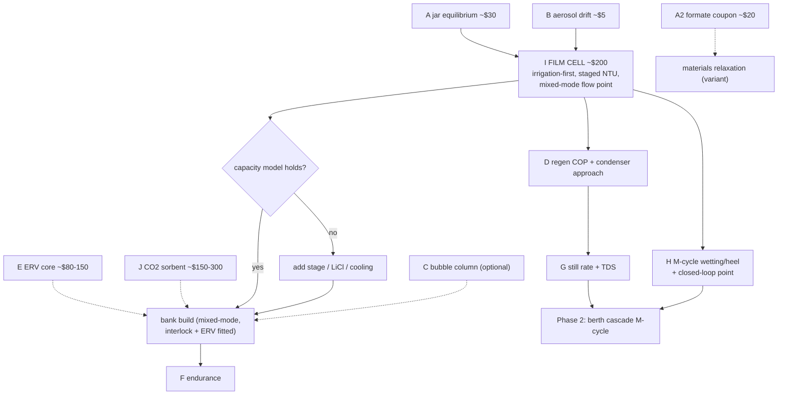

# 12 — Liquid Track: Validated Numbers, Errata, and the Gating Test Plan

### v1.4 — the quantitative record at DP-A

Two independent first-principles validation passes plus a cross-track resolution
pass were run. Everything below is the surviving, corrected set — with the error
trail kept deliberately visible.

---

## 1. Validated quantities (DP-A: 32 °C / 80%, ω 24.2 g/kg, sink ~29 °C)

| Quantity | Value | Derivation |
|---|---|---|
| Ambient ω | **24.2 g/kg** | Psat 4.76 kPa → Pv 3.81 → 0.622·3.81/97.5 |
| Target ω, 29 °C / 55% | **13.8 g/kg** | Psat 4.01 → Pv 2.20 |
| Brine floor, base 40 wt% (aw 0.45) | **11.9 g/kg at 30 °C brine** (10.0 @27 / 14.2 @33) | temperature-dependent band |
| Brine floor, hot-regen 43–44 wt% (aw 0.34) | **9.0 g/kg at 30 °C** (7.5 @27) | " |
| Fresh-air floor (4 occupants) | **48 m³/h ≈ 58 kg/h** | 12 m³/h·person, CO₂-interlocked |
| ERV pre-dry (ε 0.8) | fresh 24.2 → **15.9 g/kg** | ω_amb − ε(ω_amb − ω_cab) |
| Mixed-mode total absorber flow | **~123 m³/h (≈147 kg/h)** | hold 13.8: gains 280 g/h ÷ (13.8 − 11.9) g/kg. One quantity in two units at ρ 1.2 (doc 00 §2), not a range |
| **Peak removal, 4 adults mixed-mode** | **0.88 kg/h** (0.49 with ε 0.8 ERV... see note) | CV: fresh import + occupant/envelope gains. Bare-fresh 0.88; ERV'd steady removal ~0.5–0.6 |
| **Peak regeneration heat** | **~0.92 kW bare / ~0.6 kW ERV'd** | removal × 2.44 MJ/kg ÷ COP. The 0.92 kW figure is at **COP 0.65** — the with-recovery-HX value two rows down, not the 0.59 no-recovery build-up |
| **Daily heat, occupied DP-A duty** | **17–20 kWh bare → ~9–11 kWh with ERV(ε 0.8) + DCV** | duty-scheduled |
| CO₂-battery heat (doc 00 §5) | **~1.6–2.5 kWh/day** for 1.6 kg CO₂ | 1.0–1.3 kWh/kg incl. water co-adsorption + sensible |
| COP build-up (no recovery HX) | **≈0.59** | latent 0.678 + brine sensible 0.184 + air sensible 0.131 kWh/kg, ×1.15 losses; recovery HX → ~0.65 |
| Solar array (ERV'd budget) | **2.5–4.5 m²** flat-plate class / ~2 m² ETC top-lift with PVT preheat | 9–11 kWh ÷ 2.5–3 kWh/m²·day |
| Diesel heater-only, full duty | **~1.1–1.4 L/day** | ÷ 8.5 kWh/L |
| Absorption heat into brine | **0.66 kW peak** | 0.88 kg/h × 2.7 MJ/kg |
| Uncooled contactor self-limits | +5–8 K → floor 12–14+ g/kg | air removes only ~16 W/K per 48 m³/h |
| Cooling leverage | **0.5–0.7 g/kg per °C** of brine cooling | aw 0.45 band; land cool-water sinks exploit this |
| Raw-water cooling flow | **~300 L/h** base (2 K rise) / 600–900 heat-rich | 0.66 … 2 kW rejection |
| Unattended thresholds, 1 contactor | **~90 m³** holding 13 g/kg / **~160–215 m³** mold-safe | 120 g/h capacity vs 0.1 ACH × Δω |
| Overnight reserve (4 adults) | **~35–40 kg** concentrate | 12 h duty ÷ 0.143 |
| CO₂ at the ventilation floor | 1,920 awake / 1,400 asleep | 0.072 m³/h ÷ 48 — **above the <1,000 spec; closed by the doc 00 §5 stack** |
| Berth cascade M-cycle | supply 22.6 °C · ~102 W/outlet · ~4.1 L/day | working ⅓ from cabin, exhaust sat ~27 °C |
| Whole-cabin once-through (X1, why deferred) | 5.5–11 kg/h absorber duty at 1–2 kW sensible | 370–750 m³/h all-ambient supply |
| Still driving force | 10–65 kPa ΔPv | pool 60–93 °C vs 29 °C-sink condenser (4–5 kPa) |
| Still footprint, 0.9 kg/h | 0.5–0.9 m² tray | ~1–2 kg/h·m² at design ΔT |
| Air-swept exhaust (degraded) | ~98 g/kg, dew point **53 °C** → condenser recovers ~64 g/kg | X8 rule 3; condensate technical-grade PENDING TDS |
| Crystallization liquidus | 40 wt% ≈ **12–13 °C**; 42 ≈ 18–19; 44 ≈ 22 °C | CaCl₂ solubility curve |
| Electrical, film primary | **25–50 W** initial / **50–80 W** scaled (+ERV/exhaust fan) | fans 25–40 + recirc 15–30 + raw water 5–15 + peristaltic |
| Electrical, column annex | ~100–140 W drilled rings; 170–380 W membrane diffusers — avoid | erratum 3 |

## 2. Errata — the correction trail (kept visible on purpose)

1. **Regeneration heat overstated 2×** in first-pass tables; corrected by
   re-derivation. *Lesson: never cite a margin as a computed value.*
2. **Absorber outlet is a band, not a point** (temperature-dependent);
   absorber cooling reclassified optional → **required**.
3. **Diffuser dynamic wet pressure was missing** from the column blower budget —
   membranes silently double–triple electrical draw; drilled rings win.
4. **Nylon removed** from approved materials (CaCl₂ ESC of polyamides).
5. **Crystallization threshold corrected** (40 wt% liquidus ~12–13 °C, not ~5);
   interlock restated at 42/43 wt%.
6. **Regen exhaust condensate**: 53 °C-dew-point exhaust rains salty condensate —
   sloped drip-leg routing mandatory; the sealed still is the logical endpoint,
   and the X8 condenser (doc 11 §4) is the corrected degraded mode.
7. **Sparger head constant** 1.35–1.4 kPa per 10 cm at SG 1.4.
8. **Once-through could not deliver 4-adult comfort at the governing point**
   (59–66% RH) — mixed-mode adopted as the occupied baseline; once-through
   re-scoped to unattended/low-occupancy. *Lesson: re-run every comfort claim
   when the design point moves.*
9. **The self-consistent steady state, not the hand chain, sizes the system** —
   cabin humidity, supply state, and duty must be solved together (doc 00 §4);
   hand-chained state tables drifted 15–30% on duty.
10. **OPEN — the ERV effectiveness behind the ERV'd duty line.** Doc 10 §3 carries
    an ERV pre-dried fresh state of 17.4 g/kg; §1 above carries 15.9 g/kg. Only
    15.9 follows from the specified ε ≥0.8 (24.2 − 0.8 × 10.4); 17.4 implies
    ε ≈ 0.65. The published ERV'd figures — 0.49 kg/h removal and ~0.6 kW — track
    17.4, so they are effectively the ε 0.65 case wearing an ε 0.8 label; at a true
    ε 0.8 the removal falls to ~0.40 kg/h. Both values are left standing and flagged
    rather than reconciled on paper, because **test E measures the real ε_lat**
    (and its salt-aerosol fouling trend) and will settle which case the design
    actually operates in. Nothing downstream is load-bearing on the difference: the
    bare-fresh 0.88 kg/h peak governs the sizing. *Lesson: an effectiveness quoted
    beside a duty is a claim about both — check that the duty was computed at the
    effectiveness printed next to it.*

## 3. Dominant sensitivities

| Parameter | Uncertainty | Effect |
|---|---|---|
| **CaCl₂ water activity vs wt% and T** | published data ±0.05 aw | ±1.5–3 g/kg on the floor — the largest unknown. **Measure (test A)** |
| **Film K·a with brine** | literature 1–3 kg/m³·s | contactor depth 1–3 stages (test I) |
| **Wetting rate** | 150–240 L/min·m² demanded | underwetting collapses K·a nonlinearly — test I varies irrigation *first* |
| **ERV real ε_lat + fouling** | vendor data vs salt aerosol | gates the 9–11 kWh/day budget (test E) |
| **CO₂-sorbent working capacity / water co-adsorption / slip** | DAC literature vs this regime | gates X10 entirely (test J) |
| Occupant moisture generation | 50–90 g/h·person | ±30% on load |
| Infiltration (unattended) | 0.05–0.15 ACH | one vs two contactors |
| Drift-eliminator + demister effectiveness | unquantified for brine | gates cabin connection (test B) |
| Fan/pump efficiencies | factor ~2 at small scale | measure real amps |

## 4. Test plan — cheapest decisive experiment first

| Test | Cost | Decides |
|---|---|---|
| **A — jar equilibrium** (days) | ~$30 | Real aw table: sealed jars, RH probe over CaCl₂ 35/38/40/42/44 wt% (+LiCl arm) at ~27 and ~33 °C. **Go/no-go: 40 wt% @ 33 °C ≤ 55% ERH** |
| **A2 — aerated hot coupon** (weeks) | ~$20 | Whether potassium-formate brine survives *aerated* 80 °C service — materials relaxation for that variant only |
| **B — aerosol drift** (1 week) | ~$5 | Bare mild-steel coupon downstream of eliminator + demister, max face velocity, trickle *and* flooded. Any rust = redesign before cabin connection. Also arbitrates the solid track's liquid-desiccant verdict (X3) |
| **E — ERV core** (weeks) | ~$80–150 | Real ε_lat; salt-aerosol fouling trend (U-tube ΔP); condensation at DP-A inlet; **CO₂ crossover / EATR <5%** |
| **I — film cell prototype** (weeks, **THE GATE**) | ~$150–250 | Outlet RH vs **irrigation rate** first; 1/2/3-stage NTU/m; face velocity incl. the **~123 m³/h mixed-mode point**; rocking rig 5–20°; flooded run; wet/dry crystallization hygiene |
| **J — CO₂ sorbent** (weeks) | ~$150–300 | Working capacity at 1,000–1,500 ppm / 45–55% RH; desorption completeness 85–95 °C in the half-cycle; water co-adsorption penalty; **amine/ammonia slip (breathing-air gate)**; oxidative fade 10²–10³ cycles. Gates X10; fallback = oversized ERV+DCV |
| **J-K — potash CO₂ sorbent** (weeks; waste-heat platform variant) | ~$40–80 | K₂CO₃-on-apolar-carbon: capacity at 1,000–1,500 ppm / 45–55% RH; regeneration completeness + kinetics at 120/135/150 °C with logged purge; support screen (apolar carbon vs TiO₂) incl. an **alumina-deactivation control**; caking/deliquescence over wet–dry cycles; **alkaline particulate/mist carryover (breathing-air gate)**; 10²-cycle stability. Runs only where a ≥ ~130 °C tap exists (X11) |
| **L — hot-film absorption** (weeks; upgrade path X12, doc 31 §2 — waste-heat platforms only) | ~$60–120 | Absorption rate and approach of a 43–44 wt% film at 85/88/90 °C against ~20–25 kPa steam; drain-back-on-stop and a deliberate cool-in-place fault. Reuses the sous-vide + wet/dry-bulb stack; test A's aw table feeds the lift-ceiling inequality directly. **Gates the AHT** |
| **A3 — crystallizer jar extension** (days; upgrade path, doc 31 §6 — mass-limited platforms only) | ~$10 | Seeded vs unseeded 44 wt% parked at ~25 °C: supercooling degree, phase formed, caking over ~50–100 park/dissolve cycles, redissolution rate. Shares test A's jars and instrumentation. **Gates the static crystallizer pot** |
| D — regeneration COP (days) | ~$50 | Still tray + air-swept at 60/70/85 °C incl. PVC-tray 60 °C point and **condenser approach** |
| G — sealed-still rate (days) | ~$40 | kg/h·m² vs pool temp; condensate TDS (entrainment ≈ 0); **extended: TDS on the air-swept condenser stream** |
| H — M-cycle wetting/heel (days) | ~$60 | Supply temp vs feed humidity; 5/10/15° tilt; **closed-loop feed point (X8: recycled dried exhaust)** — shared verbatim with the solid track |
| F — endurance (months, passive) | ~$0 | Locker/closet-dryer duty: salt creep, fouling, crystallization events, ΔP trend |
| C — bubble column (optional) | ~$150 | Only if the annex is ordered; sparger DWP shootout |

**On cost figures.** The per-test estimates above are kept because they carry the
argument that matters — these are jar-and-coupon experiments, not instrumented
lab campaigns — and because they let a reader sequence the program by cost. A
single aggregate headline has been **retired**: the former `~$485–755` did not
decompose from this table, its span implied a costing exercise that was never
done, and a currency-and-date-specific total is the first thing to rot in a
record meant to be read decades from now. Read the column as **2026 order-of-
magnitude, one currency, one region**. The claim the program actually rests on
is scale, not precision: **the decisive liquid-track experiments together cost
of order a few hundred dollars**, and test A alone — the one that moves the
largest single unknown — is about $30.

## 5. Rejected CO₂-removal alternatives (quantified record; see doc 00 §5)

Zeolites (water outcompetes CO₂ at any cabin humidity) · seawater/raw-water
absorption (>6 m³/h fully equilibrated, slow hydration kinetics, re-humidifies the
air) · membranes (0.1 kPa partial pressure) · algae/plants (150+ kWh/day of light
for 3.4 kg/day) · liquid amines (volatile slip into breathing air) · soda
lime/LiOH/KO₂ (~15 kg/day — emergency consumable only) · electrochemical capture
(R&D watch item, ~1 kWh_e/kg in principle, not procurable at scale). Added by
the X11 survey: open-metal-site MOFs (Mg-MOF-74 class — water poisons and
hydrolyzes the sites, ~16% of capacity retained humid; poisoned-site recovery
sits beyond bus grade) · flue-gas physisorbent MOFs (CALF-20 — ~0.1–0.17 mmol/g
at cabin ppm, selectivity ceiling ~40–47% RH straddling the bed placement;
MUF-16 class — humid-tolerant but flue-pressure-validated, marginal at
0.1–0.15 kPa, cobalt-dust gate) · fluorinated ultramicroporous physisorbents
(SIFSIX/TIFSIX/NbOFFIVE — genuinely ppm-capable at ~1.2–1.3 mmol/g, but
7.5–10 mmol/g water co-adsorption rides every swing, SIFSIX-3-Ni phase-changes
at ~50% RH, humid/oxidative cycling instability, and a fluorometallate-pillar
degradation path upstream of breathing air) · moisture-swing
quaternary-ammonium resins (commodity AERs, but regeneration-by-wetting
evaporates its water into the cabin and re-imports it onto the brine loop —
order 5–15 kWh/day of displaced regeneration heat vs 1.6–2.5 for TSA, an X8
rule-1 violation at DP-A; capture also degrades at moderate-plus RH) ·
supported K₂CO₃ **at solar grade** (equilibrium-dead below ~120 °C — adopted
instead as the waste-heat-platform bed: X11, test J-K).

## 6. Open questions (logged, not load-bearing)

- Evaporative-media life in concentrated CaCl₂ through wet/dry cycles (inside I/F).
- LiCl sourcing vs accepting hot-regen CaCl₂ as the deep-dry lever; LiCl worsens
  wetting (revalidate irrigation margin if spiked).
- Fans/pumps: independent units vs single + manifold — measured amps settle it.
- Cool-humid (non-tropical) absorber behavior; cold-climate land installs.
- Heat-driven air pumps (NIFTE/fluidyne/thermoacoustic) — R&D track only.
- Upgrade-path watch items (doc 31, none load-bearing): AHT absorber
  materials at 90 °C brine (PVDF vs PP margin); MVR compressor mist
  carryover (test-B analogue pre-gate) and non-condensables purge cadence;
  coupled-HP refrigerant choice (R290 procurement vs R600a fit); hexahydrate
  PCM nucleator persistence (logged, low priority at DP-A).
- Distillate potability chain (baffle + TDS + carbon polish): one lab water test
  before regular drinking (safety register item 5).
- CO₂-sorbent watch register (research-grade, no supply chain; any promotion
  inherits full test-J scope): **MOF-808-AA** (glycine/lysine-appended Zr-MOF —
  nonvolatile anchored amines, water-*enhanced* uptake at ~50% RH, mild
  desorption) primary; **tetraamine-Mg₂(dobpdc)** (supersedes the mmen/diamine
  class, whose amine volatilization its own authors concede; steam-regenerable,
  ppm-validated) secondary; SIFSIX-18-Ni-β a literature line only (hydrophobic
  trace-CO₂ physisorbent — no supply chain, fluoride-pillar caveat).

## 7. Bottom line

The physics closes on independent passes and one cross-track resolution pass. The
occupied claim now reads: **4-adult comfort at DP-A stands on the mixed-mode
baseline with cooled base brine, ERV, and the CO₂ stack** — conditional on tests
A/B/E/I/J, all bench-cheap. Two-adult and unattended claims stand on the base
once-through system. Phase 2 (berth cascade M-cycle) adds no new load-bearing
physics *in the cascade topology*; whole-cabin AC is deferred on heat-scale
grounds, where the two tracks converge.

---
*Part of an open defensive-publication release: hardware CERN-OHL-P v2, text
CC-BY-4.0. No patents sought or held. Unbuilt paper design — see LICENSE.*

*Version history*
- **v1.0** — New lineage from archived core-03: all quantities restated at DP-A;
  errata 8–9 added from the resolution passes; tests E and J and the P16
  extensions integrated; CO₂-alternatives record added.
- **v1.1** — Test J-K added (§4); CO₂-rejection record extended with the X11
  survey — open-metal-site MOFs, CALF-20, MUF-16, fluorinated HUMs,
  moisture-swing AERs, solar-grade potash (§5); the mmen upgrade line replaced
  by the CO₂-sorbent watch register — MOF-808-AA primary,
  tetraamine-Mg₂(dobpdc) secondary (§6).
- **v1.2** — Upgrade-path tests L (AHT hot-film absorption, X12) and A3
  (crystallizer jar extension) added to §4 as platform-conditional entries
  outside the baseline gating budget; doc 31 watch items added to §6.
- **v1.4** — Aggregate cost headline retired from the §4 title (it did not
  decompose from the table and dates badly in a prior-art record); per-test
  estimates retained and explicitly scoped as 2026 order-of-magnitude figures.
- **v1.3** — Clarifying pass from the parameter register (doc 50 §3.5), no design
  figure changed: §1's absorber-flow row restated as one quantity in two units
  (~123 m³/h ≈ 147 kg/h) rather than a range, and the COP behind the 0.92 kW peak
  named as the with-recovery 0.65; **erratum 10 opened** — the ε_lat inconsistency
  behind the ERV'd duty line, left standing and gated on test E; §4 gains a budget
  note recording that the ~$485–755 headline no longer decomposes from the table
  beneath it.
