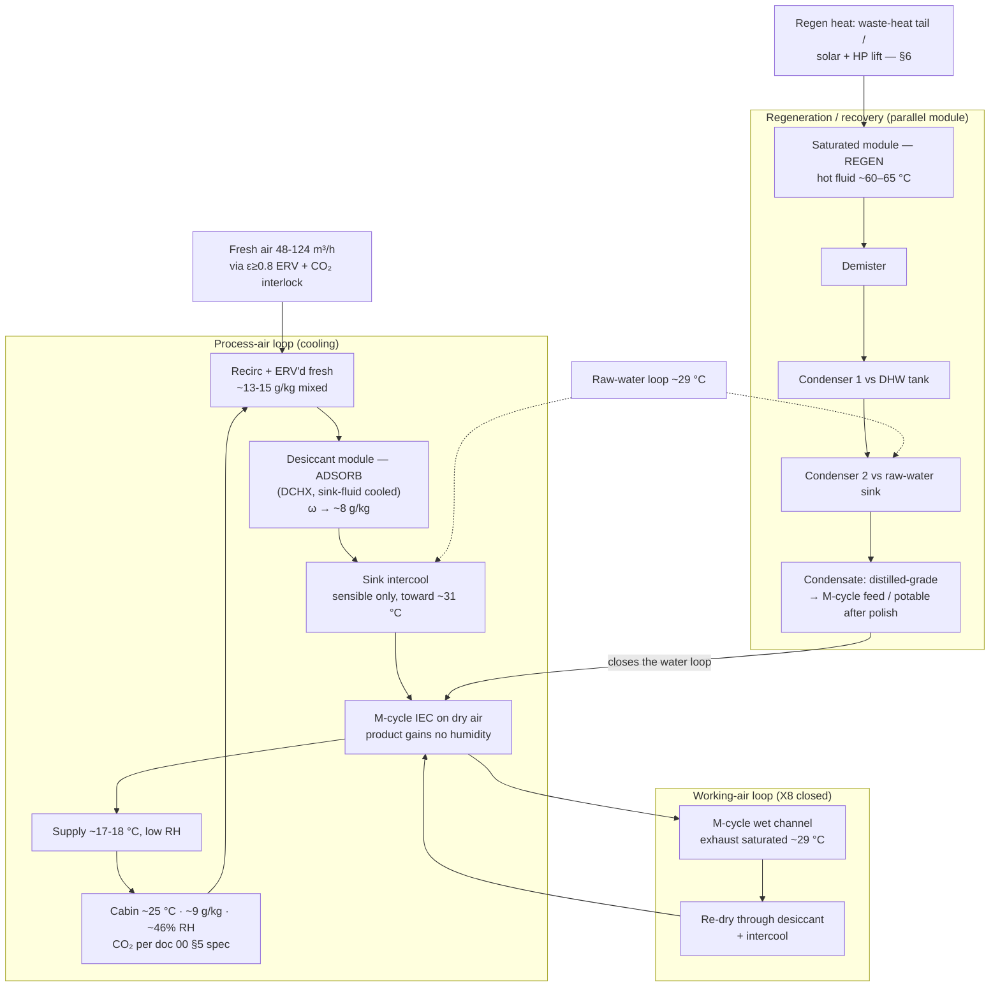

# 20 — Solid Track: System Concept, Physics, and the Corrected Balance

### v1.1 — full air conditioning from a coated-sorbent thermal swing

**Function:** Deliver genuine comfort (cooling **and** dehumidification) plus
byproduct freshwater and hot water at DP-A, from a solid-desiccant front end
coupled to a Maisotsenko-cycle (M-cycle) indirect evaporative cooler. Shared
basis → doc 00; the dew-point-floor argument that makes the desiccant
non-negotiable is doc 00 §3 and is not repeated here.

**Status of numbers:** sizing-grade unless marked; the §5 balance is the
self-consistent steady state (doc 00 §4) and is **PENDING full T2** (transient
model), which it supersedes in the interim.

---

## 1. Design point (reference scenario)

| Parameter | Value | Grade |
|---|---|---|
| Ambient | DP-A: 32 °C / 80%, ω 24.2 g/kg, DP 28.1 °C, WB ~29.5 °C | governing (doc 00 §2) |
| Raw-water sink | ~29 °C (tropical mixed layer nearly isothermal to 20–40 m; land sinks often cooler — margin) | sizing-grade |
| Conditioned volume | ~100 m³ (yacht interior / small dwelling) | platform |
| Occupants | 4 | platform |
| Sensible load (peak sun) | ~3.5 kW | sizing-grade |
| Envelope + occupant latent | ~1.8–2.8 kg/h (central 2.0) | sizing-grade |
| **Total peak sorbent duty** | **~9–11 kg/h** (self-consistent, §5) | sizing-grade, PENDING T2 |
| Comfort target | ~25 °C, ~40–55% RH | requirement |

Envelope tightening remains the cheapest intervention against its term — but the
envelope term is not the dominant one (§5).

## 2. System architecture

A desiccant + M-cycle hybrid with a heat-rejection loop doing triple duty (intake
pre-cool, regeneration condensing, general rejection), plus water and heat
recovery. Two or more desiccant-coated modules alternate: one adsorbing in the
process path while the other is valved into the closed regeneration loop; valves
swap each ~10-min half-cycle.

**Air topology (adopted):** recirculating process loop with **closed working-air
recovery (X8, §8)** as the design intent — the M-cycle working stream is re-dried
and returned rather than exhausted; ventilation is a dedicated fresh stream
through its own ERV, sized for the doc 00 §5 CO₂ spec. The open cycle (working air
exhausted, ambient makeup) is the commissioning/fallback mode; in open cycle the
working draw comes **from the cabin** (cascade), which delivers ~600 ppm CO₂ as a
structural by-product of the F1-scale makeup.

**Psychrometric state chain (sizing-grade, DP-A, closed working loop):**

| State | T (°C) | ω (g/kg) | Note |
|---|---|---|---|
| 0 Fresh (post-ERV ε 0.8) | ~31 | ~12 | pre-dried from 24.2 |
| 1 Post-desiccant | ~50–55 | ~8 | adsorption heat partly removed by sink fluid |
| 2 Post-intercool | ~30–32 | ~8 | sensible only, to raw water |
| 3 M-cycle product (supply) | ~16.8–18 | ~8 | ε_dp ~0.7 toward ~10.8 °C dew point |
| 4 Cabin | ~25 | ~9.1 | ~46% RH — steady state, gains ÷ supply flow |
| W Working exhaust (recycled) | ~29 | saturated 25.6 | re-dried and returned; never vented in X8 mode |

Without the desiccant the same M-cycle supplies ~31 °C air — the difference
between marginal and genuine comfort is entirely the pre-dry.

## 3. Desorption energy — where the input goes

The dominant term is material-independent: evaporating water costs its latent
heat regardless of what held it.

| Energy bucket | Per litre desorbed | Driver |
|---|---|---|
| Latent floor | ~0.67 kWh/L | heat of vaporization (fixed) |
| Binding excess | +0.05–0.30 kWh/L | sorbent-dependent (MOF low) |
| Sensible bed cycling | +0.03–0.10 kWh/L | thin coatings minimize; partly recoverable bed-to-bed |
| **Total** | **~0.8–1.0 kWh/L** | latent floor is 70–85% |

Of the input, only ~10–15% is recoverable **in principle**; what is recoverable *in
practice* is far less, and the two figures are on different bases. Condenser latent is
downhill and capped by DHW demand — ~1–3 kWh/day, which is only a few percent of the
~200 kWh/day of regeneration input the corrected §5 duty implies (the 35+ kWh/day figure
this sentence formerly compared against predates the F1 correction). Most of the heat is
rejected to the sink, and **only the sensible bed-to-bed clawback actually reduces
input.** Recapture order per doc 00 §7 rule 4.

## 4. Ten-minute cycling — the sensible-heat caveat

Short half-cycles buy throughput from coated area (doc 22 §1) but thermally cycle
the hot/cold fluid inventory and manifolds every swap; the sensible-cycling bucket
above may be optimistic for the *plumbing*, not just the bed. Bed-to-bed heat-pipe
recovery and manifold thermal mass minimization are design responses; M3's blank
run measures the real overhead.

## 5. The corrected peak balance (F1, self-consistent)

**The naive sizing error:** sizing to the envelope latent load (~2 kg/h) ignores
where the sensible heat goes. At DP-A the raw-water sink (29 °C) cannot absorb
heat from a 25 °C cabin — so **all cabin sensible load exits evaporatively via the
M-cycle working air**, whose moisture must pass through the desiccant (whether
exhausted-and-replaced in open cycle, or recycled in X8 mode — the drying duty is
equivalent within ~10–16% because DP-A ambient is nearly as wet as saturated
exhaust, 24.2 vs 25.6 g/kg).

Self-consistent steady state (doc 00 §4; Q_sens 3.5 kW, T_in 31 °C, ω_sup 8 g/kg,
gains 2.0 kg/h, ε_dp 0.7):

| Quantity | Value | Basis |
|---|---|---|
| Supply airflow | ~0.43–0.51 kg/s (~1,350–1,590 m³/h) | topology-dependent (dry-draw vs cabin-draw) |
| Supply temperature | 16.8–18.1 °C | working-air dew point |
| Cabin steady state | **~9.1 g/kg / ~46% RH** | gains ÷ supply flow — drier than target, headroom exists. (Corrected from ~40%: 9.1 g/kg at 25 °C is 46% RH. Still inside the 40–55% band, so the headroom conclusion is unchanged) |
| Working airflow | ~0.13–0.16 kg/s (400–500 m³/h) | Q_wet ÷ Δh |
| **Total peak sorbent duty** | **~9–11 kg/h** | working term + fresh import + gains |
| Regen heat, continuous | **~7.5–9 kW** | ~0.85 kWh/L × duty |
| Parasitic electrical | **~0.6–1.0 kW** PENDING measured ΔP | fans (supply 300–660 W + working 60–145 W at 250–550 / 150–350 Pa, η 0.32) + pumps 100–250 W |

**Closure — why this is coherent:** the moisture pushed through the desiccant
returns at the regeneration condenser as ~150–220 L/day of condensate, covering
the M-cycle wet-channel feed with a **~50–70 L/day potable-grade surplus** (the
gains + ventilation terms). Note the three quantities are distinct and only the
middle one is the condensate: at 9–11 kg/h the desiccant passes **216–264 L/day
desorbed**, of which ~150–220 L/day reaches the condenser train as **recovered**
condensate and the balance **leaves with the ventilation exhaust**. Sizing the
condenser off the desorbed figure rather than the recovered one is the safe error.

The system resolves into a **heat-driven chiller that pumps cabin heat to the sink as
vapor**, with water as the internal working medium. Comfort margin note: the cabin
settles drier (~46% RH) than the 55% ceiling, so a warmer supply setpoint can trade
comfort headroom back into duty — a T2 optimization, with the steady-state model to
run it in.

**Softening conditions:** milder ambient, warmer setpoint, or cabin >~31 °C
(partial sink-side sensible rejection) all shrink the duty; DP-A is the
continuous-duty maximum by definition.

## 6. The energy source decides everything

| Heat source | Regen heat cost | Verdict at DP-A |
|---|---|---|
| Electric resistance | full price | Loses to vapor-compression AC; justified only by silence / no-refrigerant / self-sufficiency |
| Solar-thermal PVT direct (~45–50 °C) | free, low-grade | **Equilibrium-dead at the peak point (F2):** against a condensing purge (~25 g/kg) a 45–50 °C bed faces ~29–38% RH at its face — at/above AlFu's step. Zero driving force; no kinetic result rescues it. Shoulder conditions only |
| PVT + small heat-pump lift (to 60–65 °C) | mostly free + COP-leveraged electric | Fallback path; preserves a waste-heat-independent comfort island |
| Low-grade waste heat (reactor/process tail, used at 60–65 °C) | free | **Primary path.** Comfort + water at parasitic electrical cost |

**Regeneration temperature is purge-humidity-dependent** — the most-misquoted
figure in the sorbent literature for this duty. AlFu's "~50 °C regeneration" is
valid only for a *dry* purge:

| Bed temp | Purge RH at bed face (vs ~25 g/kg condensing purge) | vs AlFu step (~25–30% RH) |
|---|---|---|
| 45 °C | ~38% | above step — zero driving force |
| 50 °C | ~29% | on the step — marginal |
| 60 °C | ~17% | below — works |
| 65 °C | ~13% | below — comfortable |

The RH column above is computed at **~23 g/kg**, which is the condensing purge state
this table was built on; the design basis is stated as ~25 g/kg and M2 is specified
against a logged ~24 g/kg purge. The spread moves the 50 °C row between 29% (on the
step) and 32% (above it) — i.e. exactly across the F2 boundary, which is why M2 logs
the purge humidity rather than assuming it.

Design basis: **60–65 °C** open-cycle regeneration, PENDING M2 for completeness
and kinetics within the 10-min half-cycle. Contrast with the liquid track's
sealed still, which has no purge and no such wall (doc 00 §3, finding X2) — the
structural reason the tracks layer rather than compete.

## 7. Water and heat-recovery strategy

**Water is a byproduct of comfort, not a product to manufacture — unless heat is
free.** Baseline condensate is genuinely free; route it to the M-cycle wet
channel, which specifically wants low-TDS feed (the M-cycle *concentrates*
dissolved solids — distilled condensate is the ideal feed and protects the HMX).
Deliberately making *incremental* water costs ~0.85 kWh/L versus ~4–20 Wh/L for
marine RO — over-harvesting is reserved for free-heat windows. Vapor-derived
condensate over an inert crystalline sorbent is intrinsically distilled-grade;
polish only the potable fraction (particulate + UV; one lab test before regular
drinking — doc 00 §8). Heat pipes for bed-to-bed sensible recovery and
condenser→tank transport; the regenerated dry module doubles as a small
**thermochemical store**; thermoelectrics rejected (~1–2% at available ΔT).

## 8. X8 closed working-air loop (design intent)

Route the saturated wet-channel exhaust through the desiccant and back, instead
of overboard-with-ambient-makeup (doc 00 §7 rule 3):

- **Duty ≈ open cycle at DP-A** (+16% swing, partly bought back by the colder
  dry-draw supply and the ERV'd ventilation term) — DP-A ambient is nearly as wet
  as the exhaust, so closure is nearly free at the governing point. Net
  atmospheric enthalpy rejection of the open cycle is ≈ 0 here; size the condenser
  for closed-loop duty at DP-A (the maximum).
- **What closure buys:** the M-cycle becomes **water-neutral in every ambient**
  (the open cycle turns net water *consumer* in dry weather); sealed-envelope
  operation (storm/spray/dust); zero salt-aerosol ingestion on the working path
  (F5 mitigation); full condensate custody.
- **CO₂ correction:** closure forfeits the open cycle's incidental ~600 ppm —
  the dedicated fresh stream alone reads 1,920 ppm at 48 m³/h. Meet the doc 00 §5
  spec by sizing ventilation (~124 m³/h ERV'd costs only +10–15% duty at this
  scale) and/or a TSA CO₂ bed.

## 9. Honest positioning

A **self-sufficiency and resilience play**, not an efficiency win over a
compressor: on battery/solar electricity it costs more energy than
vapor-compression AC plus RO. Its value: near-silence, no refrigerant, freshwater
*byproduct* instead of freshwater *cost*, DHW, clean coupling to low-grade heat,
and (X8) sealed all-weather operation. Economics improve monotonically with free
heat and become compelling with an onboard/on-site waste-heat source. With F1/F2
standing, **peak-day full AC is waste-heat-coupled** (or heat-pump-assisted); the
solar island — and, in the merged program, the liquid track — covers shoulder
conditions and degraded operation. A conventional VC-AC remains the honest
off-the-shelf benchmark and electrical backup.

## 10. Design principles (distilled)

1. Dehumidification is the comfort lever; the desiccant is non-negotiable (doc 00 §3).
2. The heat-rejection loop is support infrastructure — never the drying sink.
3. The regeneration stream is the asset: small, hot, concentrated; recover water
   and heat from it first.
4. Optimize the sorbent for **desorption against humid purge**, not capture;
   regeneration-temperature claims are meaningless without a stated purge humidity.
5. Model the **M-cycle working-air moisture term** explicitly — omitting it
   under-sizes the desiccant 3–5×; solve the steady state simultaneously (doc 00 §4).
6. Throughput is governed by cycle time and coated area, not sorbent mass.
7. The energy source is the master design variable.
8. Saturated exhausts end in recovery (X8); ventilation is specified, never inherited.
9. Redundancy outranks efficiency in the field.

---
*Part of an open defensive-publication release: hardware CERN-OHL-P v2, text
CC-BY-4.0. No patents sought or held. Unbuilt paper design — see LICENSE.*

*Version history*
- **v1.1** — Clarifying pass from the parameter register (doc 50 §3.5), no design
  figure changed: cabin steady-state RH corrected from ~40% to ~46% (9.1 g/kg at
  25 °C — arithmetic label only; still inside the 40–55% band and the headroom
  conclusion stands); §5 closure now separates desorbed / recovered / exhausted
  water, which were previously conflated; §3's recoverable-fraction sentence
  restated against the corrected F1 duty; §6 records the purge humidity its RH
  column was actually computed at.
- **v1.0** — New lineage from archived 01: self-consistent §5 balance adopted
  (duty 9–11 kg/h, regen 7.5–9 kW, parasitic 0.6–1.0 kW); X8 closed working loop
  as design intent with the CO₂ correction; DP-A sole; land/marine per doc 00;
  ten-minute-cycling caveat recorded.
