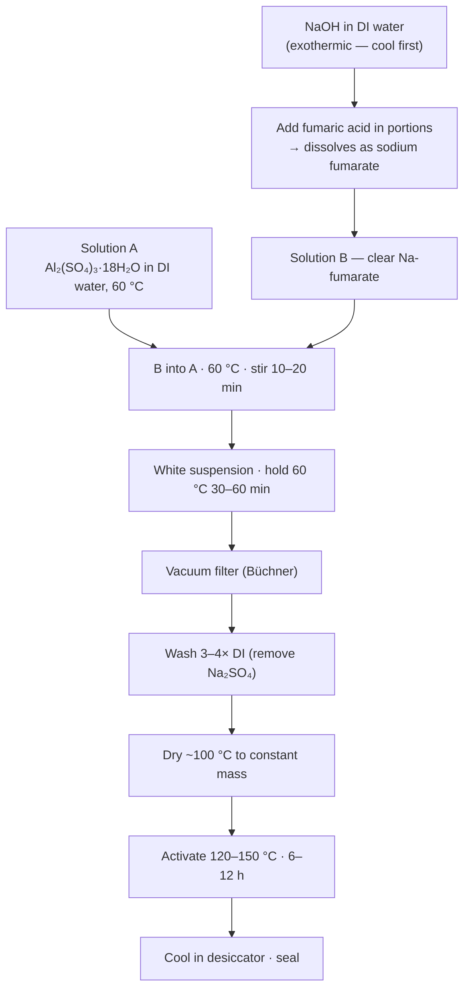
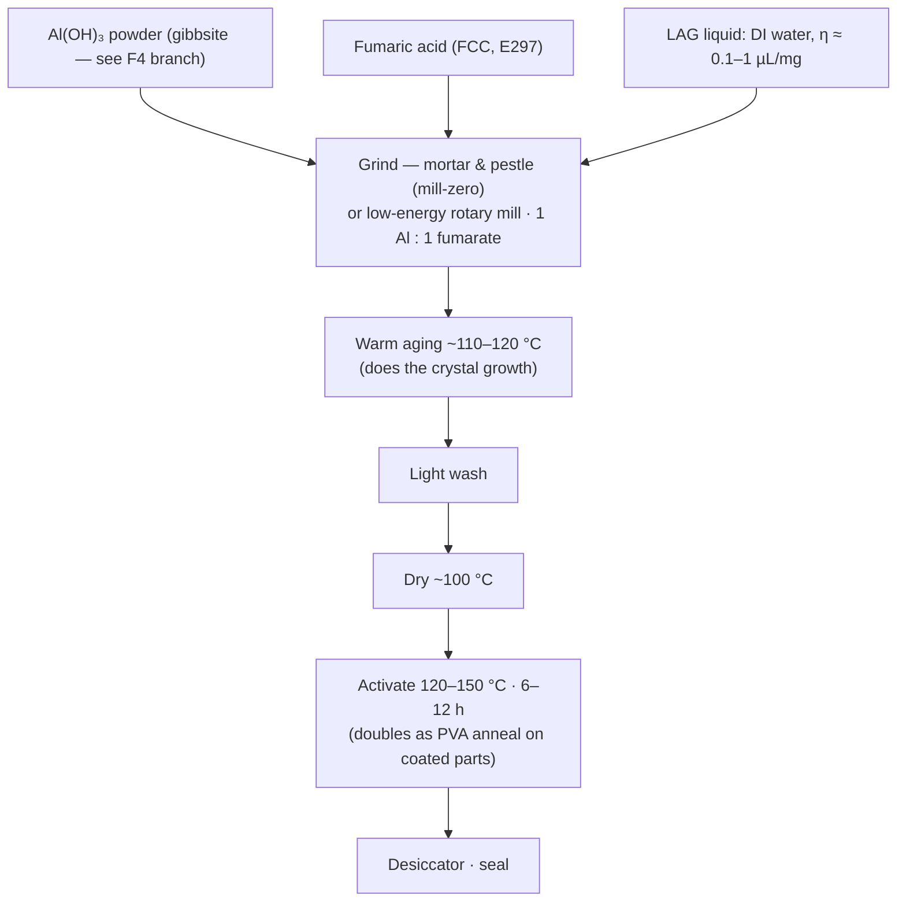
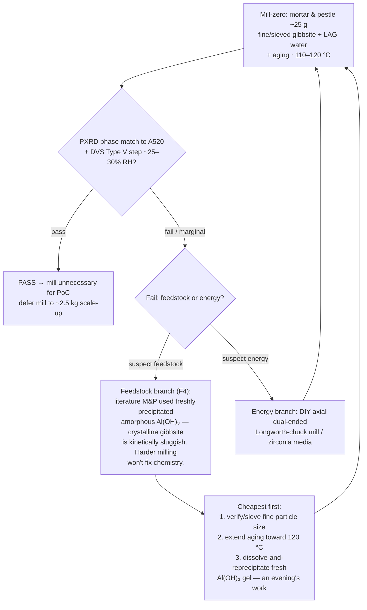

# 21 — Solid Track: Sorbent Selection & Synthesis

### v1.0 — material logic, both synthesis routes, and QC gates

**Function:** Select and produce the desiccant that makes doc 20 work: capture at
~80% RH ambient, release against a *humid* purge at the lowest practical
temperature, benign chemistry in breathing air, distilled-clean condensate,
marine-grade durability, and DIY procurability.

---

## 1. Selection framework — the isotherm step

The decisive property is the **shape and position of the water-uptake isotherm**,
not peak capacity. Type V (S-shaped) sorbents have a sharp uptake step at a
characteristic RH: nearly empty below it, nearly full above it. Capture at 80% RH
is trivial for all candidates; **regeneration is the whole game**, and the step
position sets the regeneration temperature.

> **Rule:** pick the material whose step sits **as high as possible while still
> below the minimum capture humidity** — this minimizes the temperature swing
> needed to release water against humid surroundings.

**The inverse-problem insight:** most published sorbents are tuned for *arid*
harvesting (step ≤30% RH tuned for capture), where capture is hard and release
easy. This application is the mirror image — at 80% RH the sorbent gorges itself,
and release against near-saturated surroundings is the entire challenge. Design
priorities flip: optimize for cheap, fast, **complete desorption**, and engineer
against **deliquescence** at 80%+ RH.

## 2. Candidates and verdict

| Option | Step / regen (humid purge) | Working Δq (g/g) | Durability | Breathing air / marine | Procurement | Verdict |
|---|---|---|---|---|---|---|
| **Aluminum fumarate (AlFu / A520 / MIL-53(Al)-FA)** | step ~25–30% RH → **~60–65 °C** | 0.2–0.3 (dry-purge basis — F3 note §6) | excellent; 4,500 cycles unchanged, sibling CAU-10-H to 10,000; fails only mechanically | benign, inert, clean condensate | DIY LAG + commercial validation lot | **Selected** |
| Silica gel (incl. commercial wheel) | gradual, ~80–120 °C | 0.2–0.4 | 10⁵+ cycles, marine-proven | inert, clean | trivial; turnkey wheels | **Strongest rival / benchmark (T8)** — loses only on regen grade + DCHX elegance |
| Molecular sieve 13X / activated alumina | ~150–300 °C | 0.2–0.25 | bulletproof | inert | trivial, bulk | High-grade-heat-only → forfeits the low-temp comfort island. Complement, not primary |
| AQSOA-Z05 (AlPO) | step ~50–60% RH, low regen | 0.15–0.2 | 100k cycles | inert | small lots hard; ~2× inventory | Viable, not superior |
| CAU-23 / CAU-10-H | ~60 °C, step ~30% RH | ≈ AlFu | ≈ AlFu class | benign | not commercial | **Upgrade path** (deferred until AlFu proven) |
| MOF-303 / MIL-160 | step 5–20% RH (needs drier/hotter purge) | — | good | benign | hard | Wrong step direction — worse here |
| LiCl/CaCl₂ liquid desiccant | 50–70 °C | high | self-renewing | corrosive aerosol carryover **absent demonstrated aerosol control** | commercial LDAC / this repo's liquid track | **Rejected for cabin air PENDING test B** — the liquid track's eliminator + demister + coupon chain (doc 11 §3) is the arbiter; if B passes, the tracks layer rather than compete (X3, doc 40) |
| Salt-composite / hydrogel sorbents | low regen | 0.35–0.7 | swell/leach/biofouling | conditional at best | DIY-hard | Rejected — the failure modes are exactly the field ones |

**Why AlFu wins this constraint set:** DIY-synthesizable from benign,
residential-shippable reagents; inert crystalline framework (no biocide chemistry,
no deliquescence engineering, no condensate polish); potable-clean condensate;
lowest practical regeneration among durable, makeable-or-buyable solids.
**Caveat (F2):** with solar-direct regeneration dead at the peak point, AlFu's
edge over silica gel narrows to chemistry, condensate quality, DIY-ability, and a
wider usable slice of the heat cascade — still a win, but benchmark against a
commercial silica-wheel quote (T8) and hold a commercial Basolite A520 validation
lot (T9) so coating work never blocks on synthesis.

## 3. Route A — aqueous precipitation (turnkey chemistry)

The framework is **[Al(OH)(O₂C–CH=CH–CO₂)]**, 1 Al : 1 fumarate. Aqueous
metathesis:

1. **Linker activation:** `H₂Fum + 2 NaOH → Na₂Fum + 2 H₂O`
2. **Framework precipitation at ~60 °C:** `Al³⁺ + Fum²⁻ + H₂O → Al(OH)(Fum)↓ + H⁺`
   (sulfate spectates, leaves as benign Na₂SO₄, washed out)

No toxic gas evolved; hazards are NaOH corrosivity and mild Al-salt acidity.

**Reagent quantities (scale linearly; verify hydrate assay per lot COA):**

| Reagent | Validation (~19 g MOF) | Bench (~75 g MOF) | Full charge (~2.5 kg, indicative) |
|---|---|---|---|
| Al₂(SO₄)₃·18H₂O (MW 666.43) | 41.7 g | **166.6 g** | ~5.5 kg |
| Fumaric acid (MW 116.07) | 14.5 g | **58.0 g** | ~1.9 kg |
| NaOH (MW 40.00) | 10.0 g | **40.0 g** | ~1.3 kg |
| DI water total | ~190 mL | **~750 mL** | linear |

Mole check (bench): 0.50 mol Al : 0.50 mol fumarate : 1.00 mol NaOH = 1 : 1 : 2.

## 4. Route B — LAG mechanochemical (selected PoC path)

Liquid-assisted grinding: Al(OH)₃ + fumaric acid + catalytic DI water, **no base,
no sulfate waste, minimal wash**. AlFu is the mildest known MOF mechanochemistry
case — made by **mortar and pestle plus oven aging** — so energy is *not* the
constraint; the **aging step does much of the crystal growth**.

Developmental parameters (open until frozen against §6 QC): stoichiometry 1:1, no
separate base; LAG water at η ≈ 0.1–1 µL/mg; optional ILAG salt modulator; mill
speed/time and ball-to-powder ~10:1–30:1 (mill path only); two-stage mill→age is
the working hypothesis. Expected surface area ~790–1,100 m²/g (vs ~1,135 aqueous)
— acceptable, since the binding gates are phase purity and the DVS step, not BET.

**Mill-zero gate and the feedstock-reactivity branch (F4):**

Run the reprecipitated-gel variant **before** building the mill. The mill returns
at scale-up regardless (hand-grinding does not scale to ~2.5 kg).

**Sourcing pattern (generalizable):** non-hazmat, residential-shippable reagents
(Al(OH)₃, fumaric acid, PVA); local industrial distributors for bulk alumina
hydrate; a commercial Basolite A520 validation lot (~25–100 g) in parallel —
**buy-to-validate, make-to-scale**.

## 5. Aluminum-source note

Activated alumina **cannot** be converted into an AlFu precursor by adsorbing
humidity — vapor uptake is reversible surface rehydroxylation, not bulk conversion
to gibbsite. The aluminum source remains gibbsite (fresh-precipitated preferred,
per F4) or Al salts.

## 6. QC acceptance criteria — defines "good" AlFu

Run 1–2 on every batch; 3–5 on the first batch of each new reagent lot or process
change. Freeze the recipe once a batch passes all.

| # | Gate | Criterion | Notes |
|---|---|---|---|
| 1 | Appearance | free-flowing off-white/white powder | grey/yellow/tan → suspect Fe or organic contamination |
| 2 | Yield | activated dry mass ≥ 90% of theoretical (~158 g/mol per Al) | |
| 3 | **PXRD** | matches reference A520 / MIL-53(Al)-FA, sharp reflections | compare against a simulated-CIF or literature pattern directly; never rely on memorized peak positions |
| 4 | BET (N₂, 77 K) | aqueous ≥ 1,000 m²/g (target ~1,100–1,135) · grinding ≥ 750–800 | low BET + correct PXRD usually = incomplete activation → re-activate, re-run |
| 5 | **DVS** | **Type V isotherm, step ~25–30% RH, working uptake ~0.2–0.3 g/g, reversible** | the real pass/fail gate together with PXRD |
| 6 | TGA (optional) | one clean dehydration event before framework decomposition | activation completeness |

**F3 annotation (mandatory on all sizing tables):** 0.2–0.3 g/g is a **dry-purge
full-swing** capacity. Effective swing = uptake − residual(regeneration at
60–65 °C against ~25 g/kg purge); a plausible 0.05–0.10 g/g residual cuts
effective Δq to ~0.15–0.2 g/g (+25–50% inventory), compounding F1. M2 extracts
**effective Δq under representative purge** as a first-class output.

**Characterization is outsourced** (PXRD + DVS at a university fee-for-service
facility); a submission pack (benign, non-hazmat hazard summary + requested runs)
accompanies each batch. DIY instrumentation covers everything else.

---
*Part of an open defensive-publication release: hardware CERN-OHL-P v2, text
CC-BY-4.0. No patents sought or held. Unbuilt paper design — see LICENSE.*

*Version history*
- **v1.0** — New lineage from archived 02: liquid-desiccant verdict re-scoped
  "PENDING test B" per X3; synthesis routes, F4 branch, and QC gates carried
  verbatim in substance; CO₂-sorbent MOF upgrade path noted in doc 12 §6.
