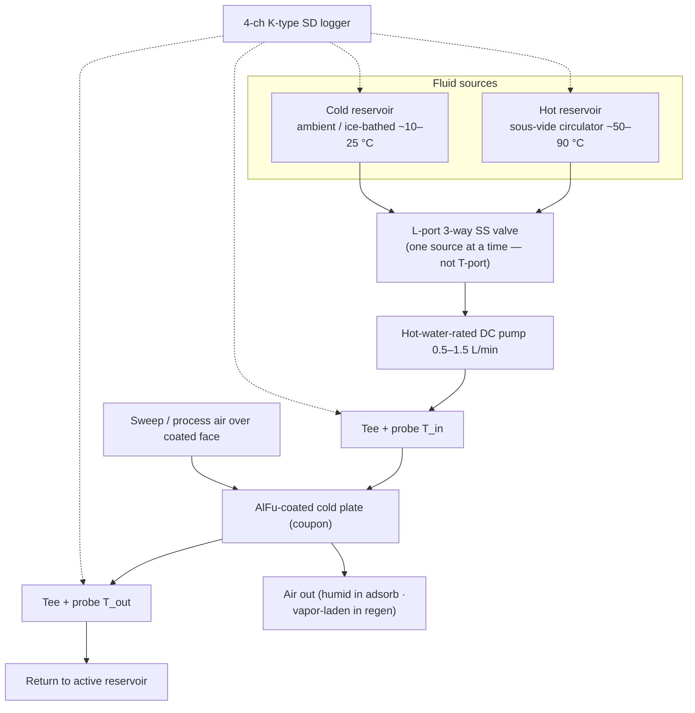
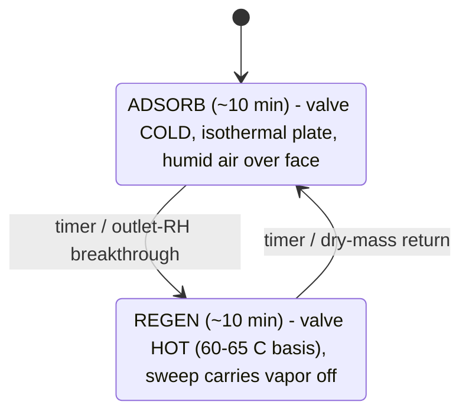
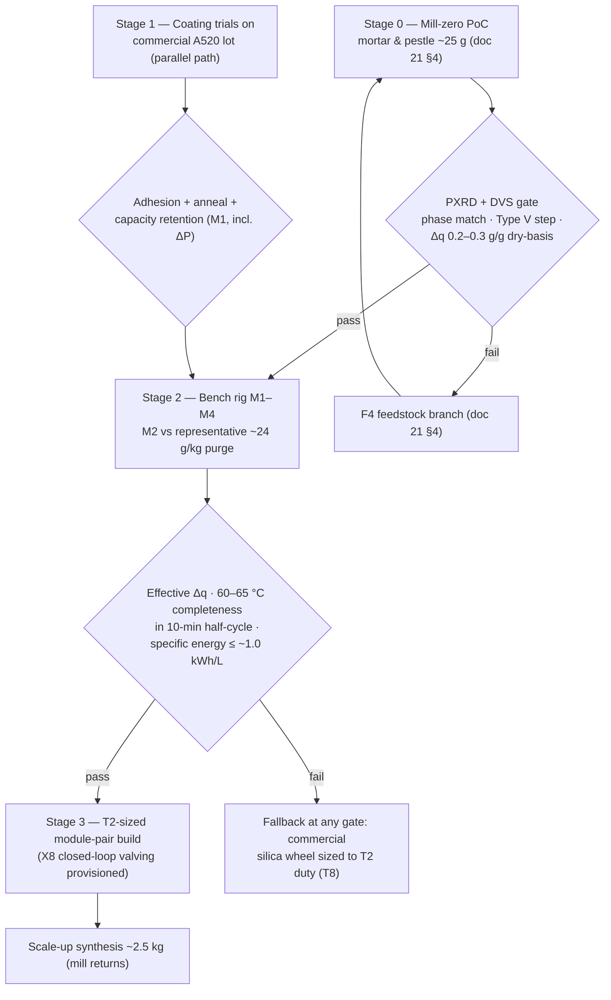

# 22 — Solid Track: DCHX Module & Bench Validation

### v1.2 — coated-exchanger design, sizing, rig, and the M1–M4 measurement set

**Function:** Turn the doc 21 sorbent into a working thermal-swing module, and
define the bench program that converts sizing-grade assumptions into measured
numbers — above all **M2**, the single most economically consequential
measurement in the program.

---

## 1. Why a desiccant-coated heat exchanger (DCHX)

Coating the sorbent directly onto a finned/plate exchanger lets one element do
both halves of the swing: **adsorb with cool fluid** in the channels (sink fluid
removes the heat of adsorption — near-isothermal bed at full capacity);
**regenerate with hot fluid** (reverse the loop; a sweep airstream carries vapor
to the condenser train). DCHX outperforms packed granular beds (~90 vs
~59 kW/m³; 3–5× heat-transfer rate) and is industrially proven in adsorption
chillers — though packaged open-cycle DCHX *dehumidifiers* remain
build-it-yourself, which is why this project exists. Geometry: flat-panel /
stacked parallel plates first; higher-area-density geometries only if a plate
stack cannot package.

**Key sizing insight: throughput is governed by cycle time and coated area, not
sorbent mass.** Two (or more) modules alternate on ~10-minute half-cycles; short
cycles with generous coated area beat a large slow bed. (Sensible-cycling caveat:
doc 20 §4.) **Qualifier (X14):** the throughput argument holds, but coated area
is not free — it carries inert mass, and the sensible penalty per unit of water
swung is independent of cycle time. Coated area therefore trades against
specific energy, and that trade is OPEN pending geometry (doc 40 F6).

## 2. Coating

Binder route (the only DIY-able route): sorbent + PVA slurry, sprayed (preferred
over dip) at ~0.1–0.5 mm onto a prepared aluminum surface (acid-etched or
boehmite-treated), ~0.18 kg sorbent/m² planform.

**Binder rules (hard requirements):**

- **PVA must be fully hydrolyzed (98–99%).** Partially hydrolyzed grades
  redissolve in humid service.
- **Even fully hydrolyzed PVA remains water-swellable near saturation unless
  heat-annealed.** The 120–150 °C activation **doubles as the mandatory anneal** —
  a re-coat must never skip it.
- Binder fraction low (~10 wt% nominal, locked by test).

Expected failure mode is **mechanical** (delamination / mass loss), not chemical —
AlFu's framework is effectively bulletproof over 10³–10⁴ cycles. Durability
testing targets the coating (M4).

## 3. Chloride exposure — finding F5 and the imported materials law

The DCHX is aluminum in a chloride-bearing environment (marine intake air; the
liquid track's brine elsewhere on the platform; coastal land sites). Design
responses, decided on paper:

- **Sealed/filtered intake path** — salt-aerosol filtration ahead of the coated
  face; in X8 closed-loop mode (doc 20 §8) the working path ingests no ambient
  aerosol at all, which is F5's primary mitigation. **Specified train (marine
  and coastal-land intakes):** multi-stage inertial vane separator → coalescing
  stage → final filter, with a drained salt-water collection sump, sized for the
  design intake face velocity. This is established marine and offshore intake
  practice — a specification, not a novel element. **Binding condition:** a
  filtered intake protects the coated face only if *all* makeup air reaching the
  conditioned space passed through the train, so the envelope must be held at
  positive pressure through the filtered inlet; unfiltered infiltration defeats
  the mitigation. The train's ΔP is inside M1's measurement scope alongside the
  coated-face ΔP.
- **No dissimilar-metal fittings** in the air path or fluid loop (extends the §5
  bench rule to the installed module); no brass anywhere near the anodic plate.
- The sorbent + PVA coating is treated as a **barrier layer whose edge and defect
  behavior in salt air is inside M4's scope**.
- Imported from the liquid track's materials law (doc 11 §1): the
  **nylon/polyamide ban** near any CaCl₂ service, the **brazed-plate-HX
  prohibition** on chloride-wetted duty, drip-loop and containment discipline on
  any shared bulkheads, and the "pool/aquaculture parts, not plumbing parts"
  sourcing heuristic.

Corrosion *rate* is empirical and lands in M4; the responses above are not.

## 4. Sizing (annotated — do not use unannotated)

Baseline at 10-min half-cycles, two alternating modules, ~0.18 kg/m²:

| Basis | Duty | Δq basis | Sorbent inventory | Coated HX area |
|---|---|---|---|---|
| Envelope-only (naive; retained as the cautionary row) | ~2–3 kg/h | 0.2–0.3 g/g | ~3–4 kg | ~10–13 m² |
| **Self-consistent peak (doc 20 §5, PENDING T2)** | **~9–11 kg/h** | 0.2–0.3 g/g | ~3–5× the above | scales accordingly |
| + F3 compounded (PENDING M2) | ~9–11 kg/h | effective ~0.15–0.2 g/g | +25–50% again | " |

**Open item — the coated-area denominator.** The table above pairs ~3–4 kg of sorbent
with ~10–13 m², which implies **~0.3 kg/m²**, while §2 specifies **~0.18 kg/m² planform**.
At 0.18 kg/m² the same inventory needs ~19 m². The likely explanation is a
one-side-versus-two-side convention — a plate coated on both faces carries ~0.36 kg per
m² of *plate* — but the documents do not say which denominator the area column counts,
and the ambiguity scales into every derived area figure. Left flagged rather than
resolved on paper: **M1 measures coated-face capacity and pressure drop on a known
geometry** and fixes the denominator empirically. Until then, size area from the stated
0.18 kg/m² planform loading, which is the conservative reading.

The correction path — faster cycling vs more coated area vs architecture revision
(warmer supply setpoint uses the comfort headroom to the 55% ceiling; hybrid brine
pre-stage per doc 40 X-register) — is **open** and is exactly what the full T2
model decides. Any independent rebuild should treat T2 as the first modeling
task, before hardware; the doc 00 §4 steady state is the interim basis.

## 5. Bench test rig — single-coupon fluid loop

The coupon is a flat aluminum water-cooling block, AlFu-coated on the external
face, temperature-controlled fluid in the channels. Switching the fluid source
between hot and cold reservoirs is the whole trick; the fluid-side ΔT yields
regeneration energy.

**Loop rules:** all-aluminum + stainless wetted path, distilled water (avoid
brass — galvanic couple with the anodic Al plate); silicone tubing on the hot
loop (PVC softens >60 °C); restrictive fittings on the pump *discharge* side;
sous-vide circulator as the precision hot reservoir.

**Duty cycle:**

First characterization runs the phases *separately* (saturate for capacity, then
clear for regeneration); cycling is for durability (M4).

## 6. The M1–M4 measurement set

| ID | Measures | Method | Pass/insight |
|---|---|---|---|
| **M1** | Adsorption working capacity (g/g) **+ coated-face ΔP** | weigh activated-dry coupon → saturate isothermally at defined inlet RH → reweigh; **U-tube manometer across the coated face at design face velocity** | single-point capacity; ΔP gates the doc 20 fan-power line (0.6–1.0 kW claim) |
| **M2** | Regeneration vs **representative humid purge** | from saturated coupon, step hot setpoint across runs — one 45–50 °C confirmation (expected marginal per F2), then **completeness and kinetics at 60/65/70 °C** against a **logged ~24 g/kg purge, RH and ω recorded** | (a) desorption completeness/rate within the 10-min half-cycle at 60–65 °C; (b) **effective Δq under realistic purge** (the F3 number). Gates the heat-source decision |
| **M3** | Specific regeneration energy | fluid-side balance **Q = ∫ ṁ·c_p·(T_in − T_out) dt**; dry/activated **blank** first (sensible + loss baseline, incl. the doc 20 §4 plumbing overhead), then wet; (Q_wet − Q_blank)/m_water; condensate cross-check by weighing | vs ~0.67 kWh/L latent floor and ~0.8–1.0 kWh/L total |
| **M4** | Cycling durability **+ salt-air edge behavior** | repeat swing 10²–10³ cycles; periodic M1 + dry-mass weigh + visual; **coating edge/defect inspection under salt-aerosol exposure (F5)** | capacity fade and **coating mass loss/delamination** — the failure mode that matters |

**M2 is run against representative humid purge, never dry lab air.** A dry-purge
M2 reproduces the literature's ~50 °C claim and tells you nothing about the
design point (doc 20 §6).

## 7. Instrumentation

**Fluid side:** 4-channel K-type SD logger; four sealed SS 1/8″-NPT probes in
inline tees — T1 plate inlet, T2 plate outlet (the ΔT pair), T3 hot, T4 cold.
**Offset-calibrate the T1/T2 pair** (isothermal bath): an uncalibrated ±1 °C bias
swamps a 3–5 °C signal in the M3 integral.

**Air-side humidity — on the critical path, not optional:**

| Regime | Sensor | Why |
|---|---|---|
| Cool, sub-saturated nodes (post-desiccant) | digital capacitive RH/T (SHT85/SHT45 class) | accurate, fast; doubles as air-node thermometer |
| Near-saturated (>80% RH) and hot regen/purge (50–65 °C+) — the M2 nodes | **wet-bulb/dry-bulb psychrometry** (dry K-type + wicked aspirated wet K-type) | capacitive sensors are spec'd to ~60 °C / 20–80% RH, drift ~+3% RH in sustained saturation — exactly the regime that matters. This is also the instrument set tests D/G/H (doc 12) reuse |

Wet/dry-bulb costs two K-type channels per air node; with the fluid loop consuming
all four logger channels, plan the channel budget before M2 (second logger, or a
unified ESP32 + MAX31856/SHT node with one timestamped CSV — the same ESP32 stack
that runs the platform interlocks). Plus: a flow figure for the M3 integral (timed
volumetric catch suffices) and a gravimetric balance. Oven setpoints independently
verified by thermocouple — never trust a consumer oven dial for the
activation/anneal step.

## 8. Staged validation pipeline

---
*Part of an open defensive-publication release: hardware CERN-OHL-P v2, text
CC-BY-4.0. No patents sought or held. Unbuilt paper design — see LICENSE.*

*Version history*
- **v1.1** — Clarifying pass from the parameter register (doc 50 §3.5), no design
  figure changed: §4 records the open coated-area denominator — the §4 sizing table
  implies ~0.3 kg/m² where §2 specifies 0.18 kg/m² planform — flagged against M1
  rather than reconciled on paper, with the conservative reading named; the comfort
  headroom phrasing follows doc 20 v1.1's corrected 46% RH cabin state.
- **v1.0** — New lineage from archived 03: F5 chloride-exposure section and
  imported materials law added (§3); ΔP measurement added to M1; salt-air edge
  behavior added to M4; sizing table restated to the self-consistent duty; X8
  valving provisioned at Stage 3.
- **v1.2** — §1 key-sizing-insight qualified per X14 (coated area is not free — it
  carries inert mass, and the sensible penalty per unit of water swung is
  independent of cycle time); §3 intake path specified by equipment class
  (multi-stage vane separation → coalescing stage → final filter, drained sump)
  with the positive-pressure envelope condition binding, and the train's ΔP
  added to M1's scope. No figure changed.
