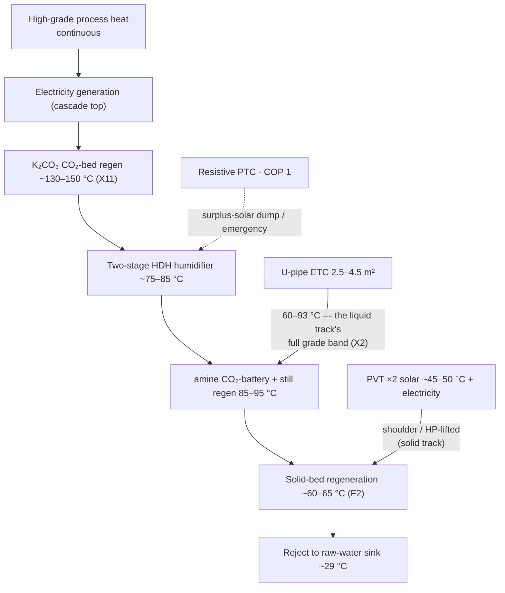
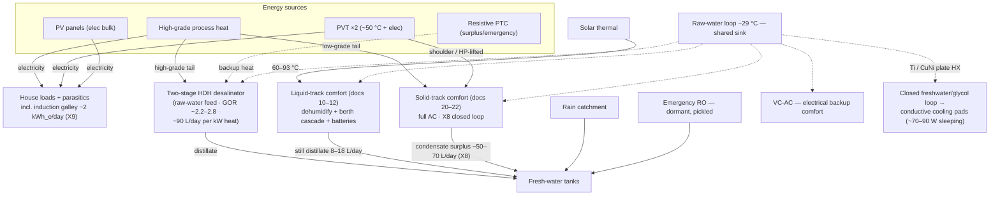
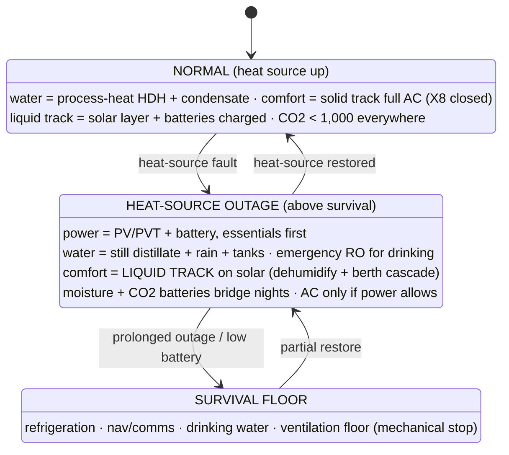

# 30 — Platform Energy & Water Integration

### v1.3 — heat cascade, multi-source strategy, redundancy ladder, degraded operation

**Function:** Place the comfort systems (docs 10–12, 20–22) inside the platform's
full energy and water architecture — vessel or land site: a high-grade
process-heat source (waste-to-energy class) at the top of a heat cascade,
two-stage HDH desalination as the primary water engine
(where a saline/raw-water feed exists), solar thermal/electric, and a
redundancy-first water ladder. **Governing reframe: redundancy outranks
efficiency in the field.**

**What the comfort systems actually require.** Nothing in docs 10–12 or 20–22
depends on the peak grade or the identity of the upstream source. The platform's
requirement is a **cascade tap at a stated grade**: 60–93 °C for the liquid
track's sealed still, 60–65 °C for the solid track's regeneration (F2), and
≥ ~130 °C where a potash CO₂ bed is primary (X11). Any source that can deliver
those taps continuously satisfies the integration; the prime mover is out of
scope for this lineage.

---

## 1. The two physical floors

Both stem from the ~29 °C raw-water sink (doc 00 §3):

1. **Evaporative cooling and sink-side condensation cannot beat the ~28 °C
   ambient dew point.** Sink-cooled atmospheric water harvesting yields ≈ 0 at
   DP-A; only a desiccant breaks the floor. Corollary: **the M-cycle is a cooler,
   not a water device.**
2. **Fresh water comes from heat (evaporate raw water → HDH/still), from air
   (desiccant), or from the sky (rain)** — three *physically independent* source
   classes; the basis of the §5 ladder.

## 2. The heat-grade cascade (organizing principle)

**Match each load to the grade of heat it needs; spend high grade only at the
cascade bottom.** A high-temperature source makes low-grade tail heat *free*,
which is what rescues the solid track's economics (doc 20 §6) and makes the X10
CO₂ battery and X8 recovery modes essentially free to run.

Notes: PVT cannot reach HDH grade, so **solar serves comfort; the high-grade
source serves water** — different subsystems. With F2, PVT-*direct* solid-bed regeneration is
dead at the peak point; **the liquid track (docs 10–12) is the natural solar
comfort island** because its sealed still keeps a positive driving force at any
solar-grade pool temperature (X2) — this supersedes the heat-pump lift as the
first fallback, with the HP lift retained behind it. Resistive heat into HDH runs
~27× RO's energy per litre — clipped-solar dump load and last resort only. The
K₂CO₃ CO₂-bed rung exists only on platforms with a ≥ ~130 °C tap; at solar
grade the amine bed serves (X11).

## 3. System architecture

**Raw-water intake:** marine — subsurface (5–10 m) for **stability and
cleanliness, not temperature** (tropical mixed layer nearly isothermal to
20–40 m). Land — well/lake loop (often cooler: free floor depth, doc 10 §3), or
an evaporative fluid cooler / dry cooler with the doc 00 §1 penalties. Surface
~29 °C water is thermodynamically sufficient for conductive body-cooling pads
(skin ≈ 33–35 °C) via an isolated Ti/CuNi plate HX into a closed low-fouling loop.

**HDH in one paragraph (the water engine, saline-feed sites):** evaporate raw
water into a closed air loop with high-grade tail heat, condense against cold raw
water — membrane-free, no high pressure, feed-tolerant, hand-repairable; the
dehumidifier doubles as the feed pre-heater. Realistic two-stage GOR with a 29 °C
sink is ~2.2–2.8 (the warm sink pinches the cold end to ~34 °C, stranding
ω ≈ 35 g/kg — lab GOR-4+ figures assume cold sinks and do not transfer). An
optional desiccant polish stage recaptures the stranded fraction (+20–25%),
justified only because regeneration heat is free. **HDH is never pointed at cabin
air** — floor #1.

## 4. Sources and roles

| Source | Grade | Primary role | Note |
|---|---|---|---|
| High-grade process heat | high, continuous | electricity + HDH water + regen tail | central engine; **single point of failure for water and power simultaneously** |
| Solar thermal (ETC 2.5–4.5 m²) | 60–93 °C | **liquid-track comfort + batteries** (moisture + CO₂) | the solar comfort island, per X2 |
| PVT ×2 | ~50 °C + elec | solid-track shoulder backup + parasitics | beyond two panels marginal thermal has no user (~36 kg each); optimal array = 2 PVT + rest PV |
| PV | elec | house/electrical bulk incl. induction galley | lighter per watt |
| Resistive PTC | COP 1 | HDH surplus-dump + emergency | never primary on metered power |

**All-electric galley (X9, safety register item 2):** no gas or combustion
appliances in the conditioned envelope — a single burner emitted 3.6× the crew's
CO₂ and ~0.25 kg/h of latent load. Induction adds ~2 kWh_e/day (trivial on a
waste-heat platform; a battery/inverter sizing line on the solar-only island). Gas
lockers, lines, and flame-failure devices leave the safety story entirely; the
galley hood ducts into the ERV exhaust with boost-on-hood interlock.

## 5. Water redundancy ladder

| Path | Source class | Independent of HDH hardware? | Rate | Role |
|---|---|---|---|---|
| Process-heat HDH | raw water + free heat | — (is the HDH) | high | **primary** (saline-feed sites) |
| Resistive-HDH | raw water + battery elec | **No — common-mode** | high | heat-source backup only |
| Solid-track condensate (X8 custody) | humid air + low-grade heat | **Yes** | ~50–70 L/day surplus at duty | comfort byproduct; water-neutral M-cycle in every ambient |
| Liquid-track still distillate | humid air + solar-grade heat | **Yes** | 8–18+ L/day | the solar-independent path; also the M-cycle feed |
| Rain catchment | sky | **Yes** | generous, intermittent | passive; design capture into deck/roof/awning |
| Emergency RO (smallest unit, pickled) | raw water + small power | **Yes** | drinking + essentials | dormant; few cycles → minimal fouling; the only path robust *outside* the humid tropics |
| Fresh-water tanks | — | **Yes** | buffer | autonomy; bridges any outage |

**Common-mode warning:** process-heat HDH and resistive-HDH share columns, raw-water
loop, and air loop — resistive backs up *heat-source* loss only. Real security
lives in the mechanically independent paths; **over-invest in the cheapest of
these (tankage + rain)**. RO is retained dormant rather than primary: the
maintenance objection applies to *running* RO; a pickled emergency unit inverts
that calculus while preserving the one path independent of sink temperature, air
humidity, weather, and the entire process-heat/HDH stack.

## 6. Failure philosophy & degraded operation

Goal on heat-source loss is **maintained operation above survival at a degraded
level**. Essential loads: refrigeration, navigation/site comms, water production.

**Recorded redundancy facts:** peak-day *full AC* is waste-heat-coupled (F1/F2) —
but with the liquid track as the solar layer, **dehumidified comfort and <1,000
ppm air quality survive a total heat-source outage** on 2.5–4.5 m² of collector, the
moisture battery (~35–40 kg/night), and the CO₂ battery (solar-window regen).
Where a potash bed is primary (X11), outage sealed operation requires the
small amine fallback bed — the ETC's ≤93 °C cannot regenerate carbonate —
otherwise degraded operation is open-mode on the ERV+DCV fallback.
Manual fallback modes everywhere (hand valves, manual resistive switch, manual
dampers **with the ventilation minimum stop**) so a controller fault cannot
disable routing or close ventilation.

**Common-mode risks:** shared raw-water loop (redundant pump + passive
ram-scoop/gravity feed + cross-connects + strainers); heat source (battery autonomy +
independent water paths + solar comfort island); controls (manual modes, hard
interlock stops); HDH mechanicals (drops both HDH paths at once — hence the
independent ladder).

## 7. Platform-level design principles

1. Redundancy outranks efficiency in the field.
2. Match heat grade to load grade; spend high grade only at the cascade bottom.
3. Independent paths are the only real redundancy; a common-mode "backup" covers
   only its own specific failure.
4. Water comes from heat, air, or sky — not meaningfully from electricity.
5. Passive-first fluid movement with active understudies (vertical-axis
   thermosyphons, wicked heat pipes, trapped siphons, check-valved backups — rated
   ~30° heel for marine).
6. Over-invest in the cheap independent paths (tanks, rain).
7. Solar for the comfort layer; PV for the electrical bulk; the high-grade
   source for water duty.
8. Saturated exhausts end in recovery (X8); no combustion in the envelope (X9);
   the ventilation floor is mechanical, not software.

---
*Part of an open defensive-publication release: hardware CERN-OHL-P v2, text
CC-BY-4.0. No patents sought or held. Unbuilt paper design — see LICENSE.*

*Version history*
- **v1.0** — New lineage from archived 04: generalized to land + marine
  platforms; liquid track installed as the solar comfort island (supersedes
  HP-lift as first fallback); X8 condensate custody and X9 all-electric galley
  integrated; gas system removed; degraded-mode air quality and ventilation floor
  added to the state machine.
- **v1.1** — K₂CO₃ CO₂-bed rung (~130–150 °C, X11) added to the cascade (§2);
  outage disposition of the potash bed recorded (§6).
- **v1.2** — §6 state-diagram labels use the `·` separator throughout, matching the
  rest of the diagram and bringing the source into agreement with its `mmd_wide`
  layout override, which had drifted from it in punctuation. No content or claim
  changed; caught by `scripts/check_release.py`.
- **v1.3** — Prime-mover references genericised throughout to high-grade process
  heat (waste-to-energy class); the peak-temperature figure removed as unused by
  any SLICE derivation; the function statement gains the explicit cascade-tap
  interface requirement (60–93 °C liquid still · 60–65 °C solid regeneration ·
  ≥ ~130 °C potash bed), which is what the comfort systems actually depend on.
  The two `mmd_wide` layout overrides were amended in step with their in-doc
  blocks. No figure changed.
