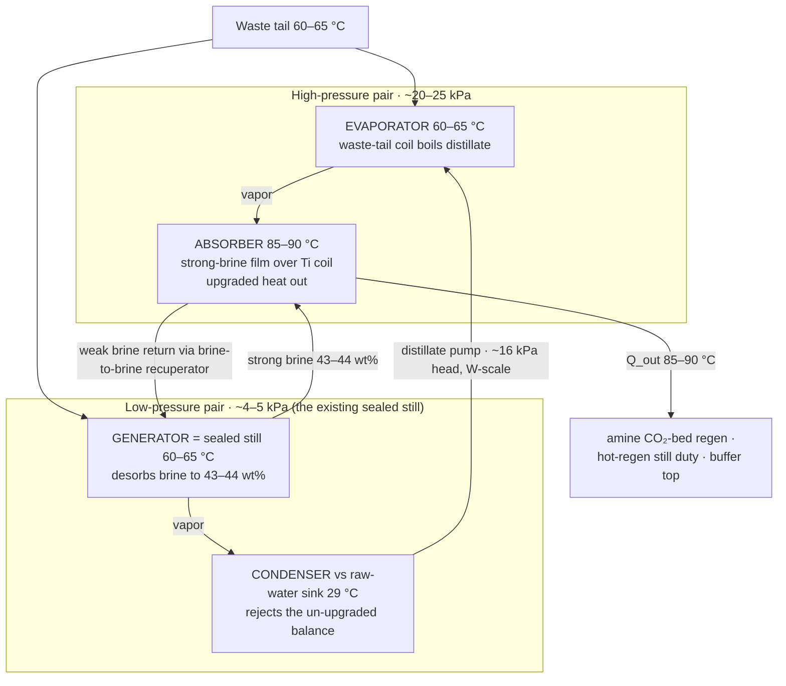

# 31 — Upgrade Paths: Sorption Cycles & Heat Pumps on the Platform Chemistry

### v1.0 — boost modes riding on the passive baseline; the CaCl₂ absorption heat transformer (X12) as the primary path

**Function:** Record the vetted family of heat-pump and sorption-cycle additions
to the platform — what each one is, what it costs in complexity, what it
unlocks, and the cheapest experiment that gates it. Shared basis, design point,
and doctrines → doc 00; liquid-track hardware → docs 10–12; solid-track
hardware → docs 20–22.

**Standing rule (binding for this document):** every path here is an
**addition or upgrade, never core**. Each one introduces something the
baseline deliberately excludes — an electrical dependence, a refrigerant
circuit, a vacuum vessel, or a crystallization-adjacent process. No DP-A
comfort, air-quality, or water claim in docs 00–30 may be made to depend on
any of them; they ride *on top of* the passive design as named boost modes,
and the baseline must remain fully operable with every one of them removed.

**Status of numbers:** estimate-grade throughout unless marked, PENDING the
named gates. Nothing in this document has been bench-tested.

---

## 1. The family at a glance — and one recorded rejection

| # | Path | Character | Converts | Into | First gate |
|---|---|---|---|---|---|
| §2 | **CaCl₂ absorption heat transformer (X12)** | heat-only, no new chemistry | 60–65 °C waste tail | 85–90 °C process heat | **test L** |
| §3 | Coupled absorber–regen VC heat pump | electron-rich boost | ~350–500 W electric | brine floor depth + regen heat | procurement + test I data |
| §4 | MVR on the sealed still | heat-outage regenerator | ~110–140 W electric | full still duty, no heat source | compressor mist pre-gate (test-B analogue) |
| §5 | Closed AlFu/water adsorption chiller | heat-rich boost | 2–2.5 kW solar/waste heat | heat-driven brine chilling | solid-track M-series + vacuum leak-down |
| §6 | Static crystallizer pot (+ hexahydrate PCM note) | mass-limited platforms | reserve tank mass | 3–5× denser moisture battery | **test A3** |

**Recorded rejection:** a heat pump as *prime mover* — lifting from the 29 °C
raw-water sink to regeneration grade as the system's primary heat source — is
rejected. At a ~35 K sink-to-regen lift the real COP_h is ~3.5–4, costing
~2 kW electric at solid-track duty; that loses outright to a 1–3 kW
vapor-compression AC and abandons the heat-flexibility value proposition
(doc 20 §9). Heat pumps earn a place on this platform **only as topping lifts
on nearly-hot heat** (§3) — never as the engine.

## 2. X12 — the CaCl₂ absorption heat transformer (primary upgrade)

### 2.1 The finding

**X12: the desiccant's activity depression is a temperature lift, not only a
humidity floor.** Water vapor absorbed into concentrated brine releases its
latent heat (~2.6 MJ/kg) *at the brine's temperature* — and because the
brine's vapor pressure is depressed by aw, absorption stays thermodynamically
downhill even when the brine sits 20–25 K **hotter** than the vapor's source.
The platform therefore already stocks every component of a single-stage
**type-II absorption heat transformer (AHT)**: the working pair is the
existing CaCl₂/water system, and the low-pressure half of the machine — the
generator and its condenser — **is the sealed still of doc 11 §4, running
unchanged at its design condition**. X12 is the dual of X2: X2 says the
still's lack of a purge keeps solar-grade *desorption* alive; X12 says the
same activity depression keeps above-source-temperature *absorption* alive.

### 2.2 The cycle — four vessels, two pressure levels

Walking the loop: (1) the still desorbs at 60–65 °C against its sink-cooled
condenser exactly per doc 11 §4, producing 43–44 wt% strong brine and
distillate. (2) A peristaltic pump lifts distillate to the high-pressure pair
— a ~16 kPa head, so unlike LiBr machines the "solution pump" is a few watts
of existing hardware. (3) In the evaporator, more of the same 60–65 °C tail
boils that distillate at ~20–25 kPa. (4) The vapor flows to the absorber,
where strong brine filmed over a titanium extraction coil absorbs it at
85–90 °C, releasing ~2.6 MJ/kg into the coil — the useful, upgraded output.
(5) Diluted brine drains back to the still through a brine-to-brine
recuperator and the loop closes. Roughly half the driving heat emerges
upgraded; the balance leaves through the still condenser the platform was
already running.

### 2.3 Governing inequality and the lift ceiling

Absorption at the high-pressure level requires

> **aw(x) · P_sat(T_abs) < P_sat(T_evap)**

which caps the absorber temperature for a given concentration and evaporator
temperature:

| Strong brine | aw | T_evap 60 °C (~20 kPa) | T_evap 65 °C (~25 kPa) |
|---|---|---|---|
| 44 wt% | ~0.34 | T_abs ≲ 85–86 °C | **T_abs ≲ 91 °C** |
| 42 wt% | ~0.40 | T_abs ≲ 81 °C | T_abs ≲ 86–87 °C |

The honest deliverable is a **gross lift of ~20–25 K into the 85–90 °C band**
— precisely the amine CO₂-bed regeneration grade (doc 00 §5) and the
hot-regen still grade (doc 11 §4), the two loads currently stranded above a
60–65 °C waste tail. The ceiling is real and single-stage: the X11 potash
rung (~130–150 °C) is **beyond reach** — a two-stage AHT could lift further
in principle but is not pursued (complexity discipline; the potash bed
remains ≥130 °C-tap hardware only). The aw table above carries the same
±0.05 uncertainty as everything else on the brine side — **test A's measured
aw table feeds this inequality directly.**

### 2.4 Performance and a sizing example

Single-stage AHT COP (upgraded heat ÷ driving heat) runs **~0.45–0.48**
before losses. Concretely: delivering the amine CO₂ battery's ~2–2.5 kWh/day
at 85–90 °C draws **~5 kWh/day of 60–65 °C tail** and rejects the balance
through the existing still condenser. Continuous form: ~1 kW of upgraded heat
per ~2.2 kW of tail. On a waste-heat platform whose tail is free, the COP is
economically irrelevant (doc 10 §3's "COP stops mattering" rule) — what the
AHT buys is **grade**, with zero electricity beyond the transfer pumps.

What it unlocks, by load:

- **Amine CO₂-bed regeneration (85–95 °C) from a 60–65 °C-only platform** —
  closing the one gap in the X11 ladder where a waste tail exists but tops
  out below amine grade, without touching the solar path.
- **Hot-regen brine (43–44 wt% → 7.5–9 g/kg floor)** where the heat bus never
  exceeds 65 °C — the deep-dry lever without LiCl and without 85–93 °C
  primary heat.
- **Buffer-top support** (doc 11 §7): trims into the 65–90 °C band from below.

### 2.5 Hardware mapping — what is new and what is not

| AHT component | Platform part | Status |
|---|---|---|
| Generator + condenser | **The doc 11 §4 sealed still, unchanged** | existing design |
| Solution/transfer pumps | Peristaltic (doc 11 §6) | existing class |
| Evaporator | New sealed tray/vessel + waste-tail coil, ~20–25 kPa | **new** — still-class construction, higher pressure than the still (easier vacuum) |
| Absorber | New vessel: strong-brine film distribution over a Ti extraction coil | **new** — the one genuinely novel part |
| Recuperator | Brine-to-brine, doc 00 §7 rule-4 class | new but conventional |

### 2.6 Materials and the crystallization inversion

The absorber runs 85–90 °C **brine** — past comfortable CPVC territory
(93 °C ceiling with no margin). **PVDF or PP-with-margin for the absorber
vessel and internals; titanium for the extraction coil**; everything inside
the two-worlds law (doc 11 §1), which is untouched. The crystallization risk
is inverted from the tropical norm: 44 wt% is safely liquid *hot*, so the
hazard is **cooldown in the absorber and its lines after shutdown** (44 wt%
liquidus ≈ 22 °C is not the issue at tropical ambient — but concentration
excursions and cool-climate land installs are). Design response, extending
safety-register item 6: **drain-back-to-still on stop** — the absorber and
its lines empty to the low-pressure sump whenever transfer stops, so no
static high-concentration inventory can cool in place.

### 2.7 Gating test L — hot-film absorption (~$60–120)

The literature K·a values for brine films are near-ambient; nothing published
speaks to film absorption at 85–90 °C against ~20–25 kPa steam. Test L is the
hot-absorption analogue of test A + I: a small 43–44 wt% film over a heated
coupon in a sealed vessel fed with ~60–65 °C steam; measure absorption rate
and temperature approach vs film temperature (85 / 88 / 90 °C setpoints), and
exercise the drain-back-on-stop behavior including a deliberate
cool-in-place fault. Reuses the sous-vide circulator and the wet/dry-bulb +
K-type stack (doc 22 §7). **Go/no-go: measurable absorption at 88–90 °C with
the test-A aw table confirming the §2.3 inequality's margin.** Runs only when
a waste-heat platform variant is actually in play — it does not join the
baseline parallel set.

## 3. Coupled absorber–regenerator VC heat pump (electron-rich boost)

Evaporator on the absorber's brine loop, condenser on the regenerator: both
ends useful simultaneously. Operating points fall out of the brine loop —
evaporator saturated ~10–15 °C (brine held 18–20 °C through an approach),
condenser ~65–70 °C (60–65 °C regen water into the buffer). A ~55 K lift with
a hot condensing end: small heat-pump-water-heater territory.

| Refrigerant | Cond. P @ 70 °C | Verdict |
|---|---|---|
| R600a (isobutane) | ~1.05 MPa | Best thermodynamic fit at high lift; low volumetric capacity → physically larger compressor, fine at 1 kW; A3, charge ~150–300 g |
| **R290 (propane)** | ~2.6 MPa | **Procurement winner** — 0.5–1 kW HPWH rotaries are R290 off the shelf; T_crit 96.7 °C clears 70 °C condensing |
| R1234ze(E) | ~1.4 MPa | A2L option if flammability governs; small compressors less common |
| R134a | ~2.1 MPa | Works; efficiency droops near 70 °C condensing; relevant because 12/48 V BLDC marine/RV rotaries are R134a |

Sizing: evaporator duty = 0.66 kW absorption heat + parasitic ingress from
32 °C air warming chilled brine through the contactor ≈ **0.8–1.0 kW steady**;
condenser output ≈ 1.1–1.5 kW, covering the 0.92 kW peak regen duty with
surplus into the buffer (DHW-capped per doc 00 §7 rule 4). Real COP_h at this
lift with a small hermetic: 2.5–3.0 → **~350–500 W electric**; inverter-driven
to track duty. Two-worlds handling: keep the refrigerant circuit entirely
standard (copper) and interpose a small glycol loop between evaporator and
the Ti sump coil — costs a 2–3 K approach, returning ~1.5–2 g/kg of the
gained floor; **net gain at 20 °C brine ≈ +3.5–4.5 g/kg**, i.e., most of the
LiCl/hot-regen benefit for ~400 W and no new chemistry. A direct Ti-tube
evaporator recovers the approach but is a custom part.

Role: **boost mode** — a 5× step over the 25–80 W baseline, admitted only as
a mode the baseline survives without. Cooling leverage per doc 12 §1
(0.5–0.7 g/kg·°C) is the conversion rate; test I's measured K·a at chilled
film temperatures refines the gain. Dual-duty note: revalved (condenser coil
into the still pool, evaporator on the still's condensate condenser), the
same machine is a refrigerant-mediated vapor recompressor — one compressor
serving §3 and §4's function with standard hardware.

## 4. MVR on the sealed still (heat-outage regenerator, ~110–140 W)

Pull vapor off the still headspace, compress, condense in a coil submerged in
the pool — the vapor's own latent heat drives further evaporation and
external heat input drops to losses. **The lift decomposes into two parts,
and the second is the one the literature misses:** at a 70 °C pool over
42 wt% brine (aw ≈ 0.40) the headspace sits at ~12.5 kPa; condensing in-pool
with a useful 6–8 K ΔT needs ~40 kPa (sat. 76–78 °C). Pressure ratio ~3 — of
which nearly half exists purely to overcome the activity depression. *The
machine pays for the desiccant's aw as pressure ratio* (the compression-side
mirror of X12). Real specific work ~120–160 Wh/kg vs ~1,800 Wh/kg thermal;
at 0.88 kg/h peak duty, **~110–140 W electric** — PV-scale, which is the
point: it makes the moisture battery rechargeable on electricity alone
through a no-sun heat outage.

Engineering record (honest): sub-atmospheric throughout — non-condensables
accumulate in the pool coil and need periodic purging (small vacuum pump or
scheduled vent-and-repump). Vapor volume ~11–13 m³/h at 12.5 kPa: small, but
PR ~3 excludes regenerative blowers (PR ~1.2 ceiling) and most diaphragm
pumps — the realistic machine is a small oil-free scroll or claw pump run as
a compressor, or two blower stages. Compression superheats ~80–90 K → a
condensate-spray desuperheater ahead of the pool coil protects seals and
improves the condensing coefficient. **Pre-gate (test-B analogue): a PP
demister ahead of the compressor is mandatory and a downstream coupon must
stay clean** — entrained chloride mist is the materials gate; past the
demister the stream is essentially clean steam and materials relax to
ordinary. Ladder slot: doc 11 §4, below the sealed still, above air-swept —
the electricity-rich degraded mode.

## 5. Closed AlFu/water adsorption chiller (heat-rich brine chilling)

The solid track's chemistry run backward for the liquid track's benefit:
instead of drying air, a closed two-shell AlFu/water cycle makes
**heat-driven chilled water for the brine sump** — §3's function with heat
instead of electricity. Two sealed shells each hold a DCHX module straight
off the doc 22 BOM (same sorbent, coating SOP, and M1–M4 characterization),
linked by check-flap vapor paths to a shared raw-water condenser and an
evaporator at ~15–18 °C chilling a glycol loop into the Ti sump coil. Beds
alternate on ~10-min half-cycles with the doc 22 rig's hot/cold fluid
switching, verbatim. Closed cycle → **no purge stream → X2-clean**: it
regenerates at genuine solar grade (60–90 °C) — the solid chemistry finally
working on solar heat, sidestepping F2 the same way the still does.

Sizing: holding brine at ~20 °C rejects ~0.9–1.0 kW of cooling duty; at a
realistic thermal COP of 0.4–0.5, that draws **~2–2.5 kW of 60–90 °C heat**
— roughly tripling the liquid track's heat demand while running (+2–3 m² of
collector if solar-fed). Strictly a heat-rich boost (engine jacket underway,
midday solar surplus). The honest hurdle: the evaporator runs ~1.7–2 kPa
absolute — deeper vacuum than §4 — with leak-tightness as the make-or-break
property, plus charge degassing and non-condensable purging. Materials
science is free (the solid track's); the vessel engineering is not. Gated on
the solid M-series regardless; whichever of §3/§5 gets built first is decided
by whether the platform is heat-rich or electron-rich.

## 6. Controlled crystallization — the static crystallizer pot

### 6.1 The pot (moderate complexity, mass-limited platforms)

CaCl₂'s hazards in circulation — the hydrate ladder (6→4→2→1→0, two
tetrahydrate polymorphs), 10–20 K supercooling without seeding, caking,
slurry in tubing — are exactly what the crystallization interlock exists to
prevent. Nearly all of that complexity evaporates under one rule: **crystals
never travel.** The tractable form is a dedicated HDPE vessel, thermally and
hydraulically isolated from the circulating loop by a normally-closed valve
pair, where hot 43–44 wt% concentrate is parked and allowed to deposit
dihydrate on cooling. Discharge is dissolution in place — meter in dilute
brine or water, stir, draw off liquid at 40 wt%. The circulating loop never
sees anything above 43 wt%; the interlock philosophy survives intact because
the pot is *designed* to crystallize and everything else remains designed
not to.

Payoff: dissolving CaCl₂·2H₂O (75.5 wt% CaCl₂) to 35 wt% takes up ~1.1–1.2 kg
of water per kg of dihydrate vs 0.143 kg/kg for the 40→35 liquid swing —
**~3–5× reserve-mass reduction** after mother liquor, shrinking the
~35–40 kg occupied-night charge toward **10–15 kg**. Meaningful where the
mass budget binds (marine); convenience elsewhere.

**Gating test A3 (~$10, extends test A):** seeded vs unseeded jars of 44 wt%
parked at ~25 °C — supercooling degree, phase actually formed, caking over
~50–100 park/dissolve cycles, redissolution rate vs stirring. Shares test A's
jars and RH/temperature instrumentation.

### 6.2 Hexahydrate PCM (logged, low priority)

CaCl₂·6H₂O melts ~29–30 °C — one of the oldest PCM systems, with its two
vices (supercooling, phase segregation) and standard fixes (1–2 wt%
SrCl₂·6H₂O nucleator, silica/CMC thickener) well documented; static sealed
containers, no pumping — genuinely low complexity. The problem is value, not
complexity: at DP-A the melt point sits essentially *at* the sink
temperature, leaving almost no ΔT to charge or discharge against. It earns
its mass only in shoulder climates or paired with a §3/§5 chiller that can
freeze it — an accessory to a boost mode, not a standalone item. Logged;
no test assigned.

## 7. Decision record — which first

| Platform character | First upgrade | Because |
|---|---|---|
| Waste-heat tail ≤65 °C, sealed operation wanted | **§2 AHT (X12)** | Unlocks amine-bed grade and hot-regen floors from heat already free; no new chemistry; the still is half the machine |
| Electron-rich (big PV/battery), heat-poor | §3 VC heat pump → §4 MVR | ~400 W buys LiCl-class floors; ~120 W keeps the moisture battery rechargeable through heat outage; one compressor can serve both |
| Heat-rich solar, electricity-poor | §5 adsorption chiller | Converts surplus heat to floor depth; waits on the solid M-series anyway |
| Marine mass-limited | §6 crystallizer pot | 3–5× denser moisture battery for one vessel and a $10 jar test |

Every path preserves doc 30 §7 principle 1 — redundancy outranks efficiency —
because each is severable: the passive baseline beneath it is untouched.

---
*Part of an open defensive-publication release: hardware CERN-OHL-P v2, text
CC-BY-4.0. No patents sought or held. Unbuilt paper design — see LICENSE.*

*Version history*
- **v1.0** — Initial upgrade-paths document: X12 AHT recorded as primary with
  cycle, lift-ceiling inequality, hardware mapping, drain-back rule, and
  test L; coupled VC heat pump, still MVR, closed AlFu chiller, and
  controlled-crystallization paths recorded with gates; prime-mover heat
  pump rejection recorded; tests L and A3 registered in doc 12 §4.
