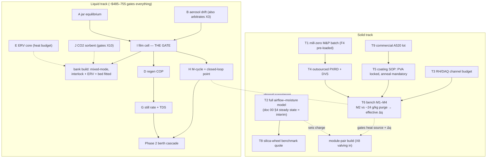

# 40 — Findings Register, Risks & Task List

### v1.3 — the honest state of the program, both tracks

**Function:** The consolidated register of every finding that materially changed
the numbers or the architecture — solid-track F1–F5 and cross-track X1–X12 — plus
the correction trail, the task list, and the make-or-break bench questions.
**Anyone reconstructing this concept should read this document before trusting
any sizing figure.** The physics backbone holds on multiple independent passes;
quantitative closure is bench-gated exactly where marked.

---

## 1. Solid-track findings (F-series)

### F1 — M-cycle working-air moisture is the dominant latent term
The sink (29 °C) cannot absorb heat from a 25 °C cabin, so all cabin sensible
load exits evaporatively via the M-cycle working air; that moisture must pass
through the desiccant (exhaust-and-replace in open cycle, recycle in X8 mode —
equivalent within ~10–16% at DP-A). **Effect: peak duty ~9–11 kg/h, not
~2 kg/h; regen ~7.5–9 kW continuous; condenser/fan duty scale with it.** The
self-consistent steady state (doc 00 §4) sharpened the original 7–8 kg/h estimate
— the hand-chained cabin state was not self-consistent. Closure: the moisture
returns as condensate covering M-cycle feed with ~50–70 L/day surplus; the system
is a coherent heat-driven chiller. Full transient T2 sets the final charge.

### F2 — Solar-direct regeneration is equilibrium-dead at the peak point
Against a condensing purge (~25 g/kg), a 45–50 °C bed faces ~29–38% RH at its
face — at/above AlFu's step: zero driving force; no kinetic result rescues it
(table, doc 20 §6). Heat-source decision: waste-heat primary; the **liquid track
is the solar comfort island** (X2), with heat-pump lift retained behind it. M2
*confirms* F2; its real deliverables are 60–65 °C completeness/kinetics and
effective Δq.

### F3 — The sizing Δq is optimistic
0.2–0.3 g/g is a **dry-purge full-swing** figure; a plausible 0.05–0.10 g/g
residual at 60–65 °C against humid purge cuts effective Δq to ~0.15–0.2 g/g
(+25–50% inventory), compounding F1. All sizing tables carry the annotation; M2
extracts effective Δq as a first-class output.

### F4 — Mill-zero needs a feedstock-reactivity branch
The literature mortar-and-pestle demonstration used *freshly precipitated*
amorphous Al(OH)₃; crystalline tech-grade gibbsite is kinetically sluggish. A
PXRD fail may be feedstock, not milling energy. Mitigations, cheapest first:
sieve fine → extend aging toward 120 °C → **dissolve-and-reprecipitate fresh gel**
(an evening vs a mill build). Integrated into the doc 21 §4 tree.

### F5 — Aluminum DCHX in chloride service
The coated aluminum exchanger sits in salt-bearing intake air with brine and raw
water elsewhere on the platform — the materials class the two-worlds rule
prohibits near chloride. Mitigations decided on paper (doc 22 §3): sealed/filtered
intake, no dissimilar-metal fittings, coating treated as a barrier layer with
edge/defect behavior in M4's scope, materials law imported from the liquid track
— and **X8 closure as the primary mitigation** (the working path ingests no
ambient aerosol). Corrosion *rate* is M4's.

### Minor notes
- **PVA anneal:** the 120–150 °C activation doubles as the mandatory anneal
  (doc 22 §2) — a re-coat never skips it.
- **Ten-minute cycling** thermally cycles the fluid inventory and manifolds; the
  sensible bucket may be optimistic for the plumbing (doc 20 §4; M3 blank
  measures it).

## 2. Cross-track findings (X-series)

| # | Finding (one line) | Where it lives now |
|---|---|---|
| **X1** | Once-through ventilation and whole-cabin M-cycle cooling never compose (5.5–11 kg/h absorber duty at DP-A); whole-cabin liquid AC deferred — in recirc topology it converges to solid-track-class duty (~10.6 kg/h, ~11 kW) | doc 00 §4/§6; doc 10 §2 |
| **X2** | Regeneration asymmetry is a theorem: the sealed still (no purge) keeps positive driving force at any pool >~40 °C; the solid bed hits F2's wall below ~50 °C → **liquid = solar layer, solid = waste-heat layer** | doc 00 §3; doc 30 §2 |
| **X3** | The old blanket rejection of liquid desiccants for cabin air is re-scoped: "rejected **absent demonstrated aerosol control** — test B is the arbiter" | doc 21 §2; doc 11 §3 |
| **X4** | Materials doctrine flows both ways: nylon ban, brazed-plate prohibition, drip discipline, sourcing heuristic imported to the solid track | doc 22 §3 |
| **X5** | The airflow cascade: route makeup through the cabin before it becomes working air — ventilation becomes latently free. Berth scale: full 48 m³/h kept (~1,920 vs ~2,670 ppm), *more* cooling (102 vs 86 W), 1.6 °C supply cost. Solid open cycle: ~600 ppm automatic at F1-scale flows | doc 10 §2; doc 20 §2 |
| **X6** | Mixed-mode recirculation (CO₂-interlocked fresh minimum + recirculated bulk) is the liquid occupied baseline — once-through fails 4-adult comfort at DP-A (59–66% RH); mixed-mode restores 55% at 0.88 kg/h. Recirc-only prohibited | doc 10 §2; doc 00 §5 |
| **X7** | ERV latent recovery on the fresh stream: (1−ε)×10.4 g/kg per kg; ε ≥0.8 saves ~9–10 kWh/day at DP-A and makes generous ventilation cheap. Requires one ducted exhaust path; CO₂ crossover <5% (test E). Applies to both tracks | doc 11 §5; doc 20 §2 |
| **X8** | Exhaust-vapor recovery doctrine: saturated process exhausts terminate in distillation recovery; no stream is both rejection sink and recovery source (protects the ERV); closed working-air loop = solid design intent (water-neutral in every ambient) and liquid free-heat option (~1.3 kWh/L); air-swept regen gains a condenser (technical water PENDING TDS) | doc 00 §7; doc 20 §8; doc 11 §4 |
| **X9** | All-electric galley, no gas in the envelope: one burner = 3.6× the crew's CO₂ + ~0.25 kg/h latent. ~2 kWh_e/day induction | doc 00 §5; doc 30 §4 |
| **X10** | The CO₂ battery: two-bed solid-amine TSA, 85–95 °C regen, ~1.6 kg/day for ~1.6–2.5 kWh/day — the only path holding <1,000 ppm sealed. **Required-PENDING test J** (slip assay gates cabin connection); fallback = oversized ERV+DCV, open-cycle only | doc 00 §5; doc 11 §5; doc 12 §4 |
| **X11** | Sealed-mode CO₂-bed chemistry is heat-grade-dependent: K₂CO₃/apolar-carbon TSA (regen ~130–150 °C; alumina/MgO supports prohibited — double-salt deactivation; breathing-air gate = alkaline-carryover assay, **required-PENDING test J-K**) is the waste-heat-platform primary; the solid-amine resin (85–95 °C) is the solar-grade bed. The ladder runs ventilation-first from the top of heat availability down; a small amine bed is retained as outage fallback where potash is primary (the ETC's ≤93 °C cannot regenerate carbonate) | doc 00 §5; doc 12 §4–6; doc 30 §2/§6 |
| **X12** | The brine's activity depression is a **temperature lift**, not only a humidity floor (the dual of X2): a single-stage CaCl₂ absorption heat transformer — with the sealed still unchanged as its generator + condenser — upgrades a 60–65 °C waste tail to 85–90 °C at COP ~0.45–0.48 with no electricity beyond transfer pumps, reaching amine-bed and hot-regen grade. Lift ceiling aw(x)·Psat(T_abs) < Psat(T_evap) → ≲91 °C single-stage (potash grade out of reach). **Upgrade path only, never load-bearing; PENDING test L** | doc 31 §2; doc 12 §4 |

**Specification P17 (safety-critical):** CO₂ <1,000 ppm at all times, all modes;
alarm + forced boost 2,000 ppm; per-room max sensing; mechanical minimum stop.
Full register: doc 00 §8.

## 3. Dependency structure and task list

**Ranking:** liquid A/B/E/J and solid T1/T9 all run in parallel at trivial cost;
test I is the liquid gate; T2 gates every solid downstream size. Shared: test H
and the solid M-cycle validation are one experiment; the wet/dry-bulb
instrumentation stack (doc 22 §7) serves both. **T7 (documentation pass) is
closed by this lineage.** Deferred: CAU-23/CAU-10-H, the CO₂-sorbent watch register (doc 12 §6 — MOF-808-AA primary; tetraamine-Mg₂(dobpdc), superseding the diamine class), two-core
sensible recovery, the hybrid brine-pre-stage-before-AlFu architecture (worth
revisiting only with hot-regen brine — the polish split favors it only then). On
waste-heat platform variants, test J-K joins the parallel cheap set (X11),
sharing J's rig and instrumentation. The **doc 31 upgrade paths** (X12 AHT
first; coupled VC heat pump; still MVR; closed AlFu chiller; static
crystallizer pot) are boost modes on the deferred list — additions riding on
the passive baseline, never core; tests **L** and **A3** (doc 12 §4) join the
cheap parallel set only when their platform trigger exists (waste-heat tail /
mass-limited reserve respectively), and the prime-mover heat-pump variant is
recorded rejected (doc 31 §1).

## 4. Make-or-break bench questions (consolidated)

- [ ] Real CaCl₂ aw vs wt% and T — 40 wt% @ 33 °C ≤ 55% ERH (A)
- [ ] Aerosol chain: clean steel coupon, trickle and flooded (B — gates every
      cabin connection and arbitrates X3)
- [ ] Film K·a, wetting threshold, staged NTU/m, mixed-mode flow point (I)
- [ ] ERV real ε_lat, salt fouling, CO₂ crossover <5% (E)
- [ ] CO₂ sorbent: capacity at 1,000–1,500 ppm / 45–55% RH, 85–95 °C
      completeness, water co-adsorption, **amine/ammonia slip**, cycle fade (J)
- [ ] Potash arm (X11): K₂CO₃/carbon capacity at 1,000–1,500 ppm / 45–55% RH;
      120/135/150 °C completeness with logged purge; alumina-deactivation
      control; caking/deliquescence; **alkaline carryover**; cycle stability
      (J-K)
- [ ] Effective working Δq under ~24 g/kg purge at 60–65 °C (F3 · M2)
- [ ] Desorption completeness/rate in the 10-min half-cycle (F2 · M2)
- [ ] Specific regeneration energy vs 0.8–1.0 kWh/L, incl. plumbing overhead (M3)
- [ ] Coating adhesion, anneal, capacity retention, **coated-face ΔP** (M1, T5)
- [ ] Coating durability + salt-air edge behavior over 10²–10³ swings (M4 · F5)
- [ ] Still rate + condensate TDS ≈ 0; air-swept-condenser TDS (G)
- [ ] M-cycle wetting/heel + closed-loop feed point (H — shared)
- [ ] Distillate potability lab test before regular drinking
- [ ] T2 outputs: charge, coated area, condenser duty, fan power at the
      self-consistent peak; correction path (cycling vs area vs setpoint)
- [ ] **Coated-area denominator** — doc 22 §4's sizing table implies ~0.3 kg/m²
      where §2 specifies 0.18 kg/m² planform (one-side vs two-side convention
      unstated). Settled empirically by M1 on a known geometry; size from 0.18
      until then (doc 22 §4)
- [ ] **Real ε_lat behind the ERV'd duty line** — doc 10 §3 and doc 12 §1 carry
      17.4 and 15.9 g/kg for the same pre-dried state, i.e. ε ≈ 0.65 vs the
      specified ≥0.8; the published ERV'd removal tracks 17.4. Settled by test E
      (doc 12 §2 erratum 10). The bare-fresh 0.88 kg/h peak governs sizing either
      way

## 5. Correction-trail principle

Every erratum stays visible (doc 12 §2 carries the liquid trail; F1's sharpening
from 7–8 to 9–11 kg/h is recorded above). The correction trail is part of the
design's credibility: *never cite a margin as a computed value; re-run every
comfort claim when the design point moves; solve steady states simultaneously,
never as hand chains.*

The parameter register (doc 50 §3.5) is the standing mechanism for this: it
re-derives every headline figure from its stated basis, so a number that has
drifted from the basis printed beside it surfaces on its `Checks` sheet rather
than surviving unexamined. Reconciling that sheet is a release gate (doc 50 §8).
Its first pass produced the two open items above, erratum 10, and a set of
basis-labelling clarifications across docs 00/10/12/20/22 — no design figure moved.
*Added lesson: a quantity is only as good as the basis printed next to it; state
the basis, or the number will eventually be read on the wrong one.*

---
*Part of an open defensive-publication release: hardware CERN-OHL-P v2, text
CC-BY-4.0. No patents sought or held. Unbuilt paper design — see LICENSE.*

*Version history*
- **v1.0** — New lineage: archived 05 (F1–F4) merged with the archived doc 06
  X-register (X1–X10, F5, P-series patches now applied in place across docs
  00–30); task T7 closed by this lineage; dependency chart unified across tracks.
- **v1.1** — X11 recorded; test J-K added to the make-or-break list and task
  notes; deferred list updated to the doc 12 §6 watch register.
- **v1.2** — X12 (CaCl₂ absorption heat transformer) recorded; doc 31
  upgrade-path family added to the deferred notes with tests L/A3 pointers
  and the prime-mover heat-pump rejection; X-range extended in the function
  statement.
- **v1.3** — First parameter-register reconciliation pass (doc 50 §3.5): two open
  items added to the make-or-break list — the doc 22 coated-area denominator
  (gated on M1) and the ε_lat inconsistency behind the ERV'd duty line (gated on
  test E, doc 12 §2 erratum 10) — and §5 records the register as the standing
  mechanism for catching basis drift. No finding ID renumbered; no design figure
  changed.
