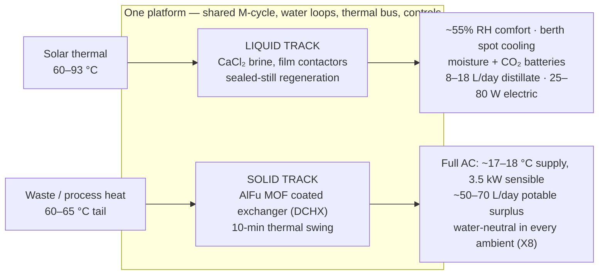
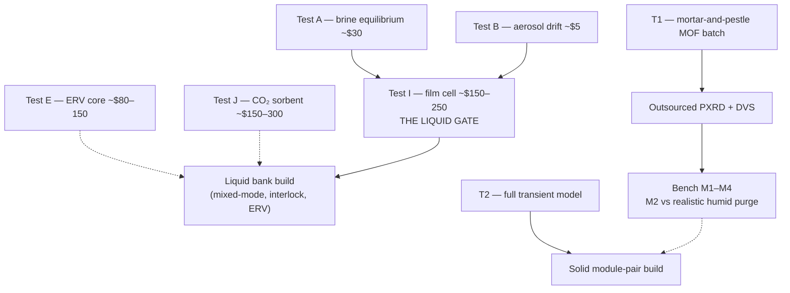

# Executive Summary — Heat-Driven Comfort & Water for Humid Climates

### v1.1 — Two desiccant tracks, one physics, one platform · Land & marine

**One sentence:** Sun or waste heat in — dry cool air, safe air quality (<1,000 ppm CO₂),
hot water, and drinking water out, for ~100 m³ occupied spaces (yacht interiors, small
dwellings, cabins, shelters) in humid climates where no conventional passive or
evaporative device can deliver comfort.

**Status:** Complete, internally consistent *paper design*, released as an open defensive
publication (CERN-OHL-P v2 / CC-BY-4.0 / MIT). **Nothing has been built.** Every sizing
claim is confidence-graded and gated on an explicit, deliberately cheap bench program:
a few hundred dollars of tests for the liquid track; a mortar-and-pestle synthesis batch plus the
M1–M4 coupon program for the solid track.

---

## 1. The problem — and why a desiccant is non-negotiable

The sole governing design point is **DP-A: 32 °C / 80% RH** (humidity ratio 24.2 g/kg,
**dew point 28.1 °C**), with a raw-water sink (sea, lake, well) at **~29 °C**. At this
point every ambient heat sink sits *at or above the dew point*, so:

- Sink-cooled condensation harvests essentially zero water from the air.
- Evaporative cooling — including the high-performance Maisotsenko (M-cycle) dew-point
  cooler — cannot cool below a 28 °C dew point on raw air.
- Vapor-compression AC works but demands 1–3 kW of electricity, a refrigerant circuit,
  and (marine) a salt-hostile machine.

Only a **desiccant** breaks the floor, because its surface vapor pressure is set by
concentration or loading, not by a cold sink. The hard problem then becomes
**regeneration against near-saturated surroundings** — never capture. That inversion of
the published sorbent literature (which is tuned for arid harvesting) drives every design
decision in the program.

## 2. The architecture — two complementary tracks

| | **Liquid track** (CaCl₂ brine) | **Solid track** (AlFu DCHX) |
|---|---|---|
| Role | **Solar-grade layer** — dehumidify to ~55% RH, spot cooling, storage batteries, degraded-mode backbone | **Waste-heat layer** — genuine full air-conditioning plus water surplus |
| Peak sorbent duty at DP-A | 0.88 kg/h | ~9–11 kg/h |
| Heat demand | ~9–11 kWh/day at 60–93 °C — any source, incl. small solar | ~7.5–9 kW continuous at 60–65 °C — waste-heat-coupled at peak |
| Electricity | 25–80 W | ~0.6–1.0 kW (pending measured ΔP) |
| Water | 8–18+ L/day distillate | ~50–70 L/day potable surplus |
| Storage | Moisture battery (~35–40 kg concentrate carries a full occupied night) + CO₂ battery | Dry module as a small thermochemical store |

**Why two tracks is a theorem, not a hedge (finding X2):** the liquid track regenerates in
a *sealed still* with no purge stream — its driving force stays positive at any pool
temperature above ~40 °C, so modest solar heat always works. The solid bed must desorb
into a *condensing, humid purge* (~25 g/kg) and hits a zero-driving-force wall below
~50 °C (F2) — the widely quoted "~50 °C MOF regeneration" is a dry-purge artifact.
Consequently **liquid = solar layer, solid = waste-heat layer**; they layer rather than
compete, and both feed one M-cycle, one water system, one thermal bus.

## 3. Findings that changed the numbers (the honest core)

- **F1 — the dominant latent term was hidden.** At DP-A the 29 °C sink cannot absorb heat
  from a 25 °C cabin, so *all* cabin sensible load leaves evaporatively via M-cycle
  working air — whose moisture must pass through the desiccant. Full-AC duty is
  **~9–11 kg/h, not ~2 kg/h**; omitting this term under-sizes the desiccant 3–5×.
- **X1 — once-through ventilation and whole-cabin M-cycle cooling never compose** (drying
  the required all-ambient supply costs 5.5–11 kg/h). Mixed-mode recirculation with a
  hard CO₂ interlock is the occupied baseline (X6).
- **X7 — an ε ≥ 0.8 enthalpy-recovery ventilator (ERV)** cuts the fresh-air latent
  penalty ~9–10 kWh/day, making generous ventilation cheap.
- **X8 — saturated exhausts end in distillation recovery.** Closing the M-cycle working
  loop makes the cooler **water-neutral in every ambient** and seals the envelope against
  storm, spray, and salt aerosol.
- **X9/X10 — air quality is engineered, not assumed:** all-electric galley (no combustion
  in the envelope) and a two-bed solid-amine **CO₂ battery** — the only path holding
  <1,000 ppm sealed — regenerated by the same low-grade heat (~2 kWh/day).
- The **correction trail is kept visible** (nine liquid-track errata; F1's sharpening from
  7–8 to 9–11 kg/h): *never cite a margin as a computed value; re-run every comfort claim
  when the design point moves; solve steady states simultaneously.*

## 4. Platform integration

A heat-grade cascade organizes everything: high-grade process heat makes electricity and
drives HDH desalination; its low-grade tail regenerates the solid track for free; solar
thermal serves the liquid track. Water arrives by three *physically independent* routes —
heat (HDH/still), air (desiccant condensate), sky (rain) — with a pickled emergency RO
unit as the only path independent of climate. **Governing reframe: redundancy outranks
efficiency in the field.** On total loss of the primary heat source, dehumidified comfort
and <1,000 ppm air quality survive on 2.5–4.5 m² of solar collector plus the moisture and
CO₂ batteries.

## 5. Safety-critical requirements (binding)

CO₂ interlock (<1,000 ppm target / 2,000 alarm / per-room max sensing / **mechanical
minimum stop** on the fresh damper) · no combustion appliances in the envelope · aerosol
and amine-slip assays before any contactor or sorbent bed touches breathing air ·
independent potability and TDS tests before any water is drunk · crystallization
interlock on the brine · the two-worlds chloride materials law on every wetted part.
Any build omitting these departs from the design.

## 6. Validation path — cheapest decisive experiment first

The entire quantitative case is gated by bench-top spend: **a few hundred dollars** decides the liquid
track end-to-end; the solid track's single most consequential measurement is **M2** —
effective working capacity at 60–65 °C against a *representative humid purge* (a dry-purge
test would merely reproduce the literature and decide nothing).

## 7. Bottom line

The physics closes on multiple independent validation passes. The design's value
proposition is **resilience and heat flexibility, not watts**: near-silent, refrigerant-free
comfort; freshwater as a *byproduct* instead of a cost; clean coupling to solar and waste
heat; graceful degradation with engineered air-quality guarantees. A conventional
vapor-compression AC remains the honest off-the-shelf benchmark — and the program says so.
What stands between paper and proof is a few hundred dollars of deliberately sequenced
bench tests.

---
*Prepared from repository docs 00–50 (lineage v1.2), whose figures are collected with
their confidence grades and gating tests in `docs/parameter_register.xlsx`. Open
defensive publication — hardware CERN-OHL-P v2, text CC-BY-4.0, scripts MIT. No patents
sought or held. Unbuilt paper design — see LICENSE.*

*Version history*
- **v1.0** — Initial standalone abstract for the examiner channel (doc 50 §7),
  prepared from the v1.0 lineage (docs 00–40).
- **v1.1** — Brought up to the v1.2 lineage: provenance line now covers docs 00–50
  (adding doc 31's upgrade paths and doc 50's disclosure procedure) and points at the
  parameter register; the bench-budget headline de-specified pending the doc 12 §4
  reconciliation. No technical claim changed.
